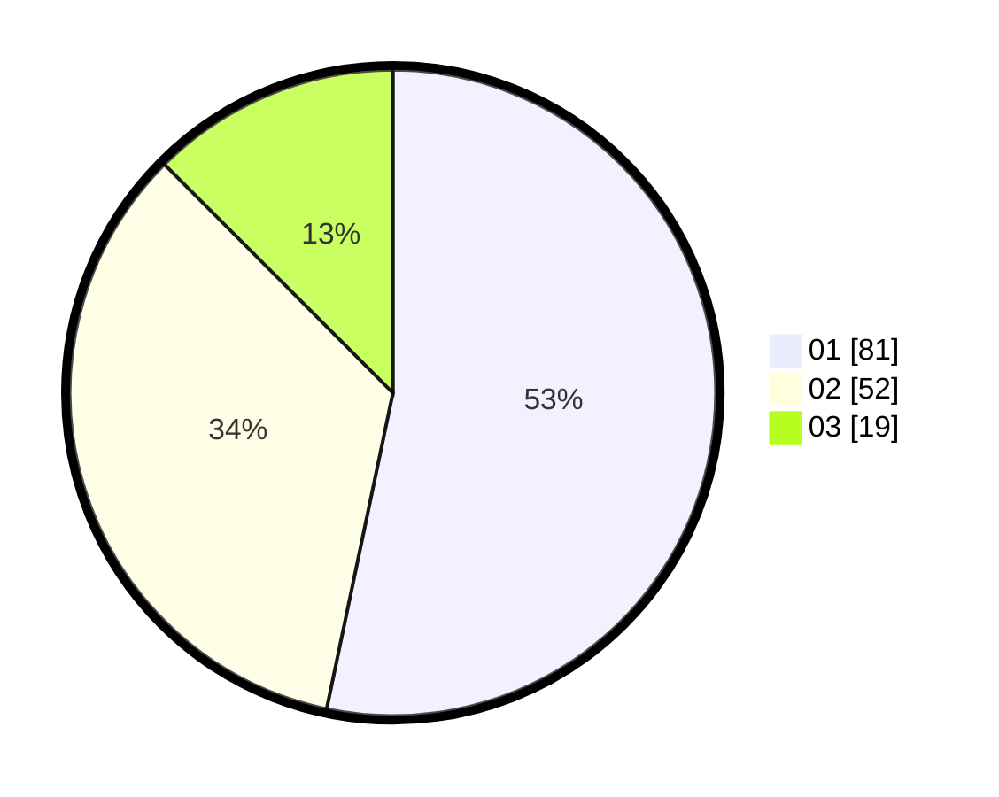

# Hasil

Hasil perolehan suara paslon dapat dilihat pada file paslon-01.txt, paslon-02.txt, dan paslon-03.txt.

Jika tidak ada, artinya data tersebut belum ada pada SIREKAP.

## Perolehan Suara

 * Paslon 01: **81**.
 * Paslon 02: **52**.
 * Paslon 03: **19**.

## Foto C Plano

https://sirekap-obj-formc.kpu.go.id/7005/pemilu/ppwp/31/73/04/10/07/3173041007027-20240214-162236--250db842-e4f7-4659-beea-c3552da877c2.jpg

https://sirekap-obj-formc.kpu.go.id/7005/pemilu/ppwp/31/73/04/10/07/3173041007027-20240216-015654--1182edbe-e0f3-4f7e-97c8-2e21308ab5f0.jpg

https://sirekap-obj-formc.kpu.go.id/7005/pemilu/ppwp/31/73/04/10/07/3173041007027-20240216-015649--69ee7868-6192-4a6c-8f51-2d4cef907b87.jpg

## DATA PEMILIH TETAP

Jumlah pemilih dalam DPT: **225**.
 * L: **120**.
 * P: **105**.

## DATA PENGGUNA HAK PILIH

Jumlah pengguna hak pilih dalam DPT: **154**.
 * L: **78**.
 * P: **76**.

Jumlah pengguna hak pilih dalam DPTb: **0**.
 * L: **0**.
 * P: **0**.

Jumlah pengguna hak pilih dalam DPK: **6**.
 * L: **1**.
 * P: **5**.

Jumlah pengguna hak pilih: **160**.
 * L: **79**.
 * P: **81**.

## JUMLAH SUARA SAH DAN TIDAK SAH

JUMLAH SELURUH SUARA SAH: **152**.

JUMLAH SUARA TIDAK SAH: **8**.

JUMLAH SELURUH SUARA SAH DAN SUARA TIDAK SAH: **160**.
