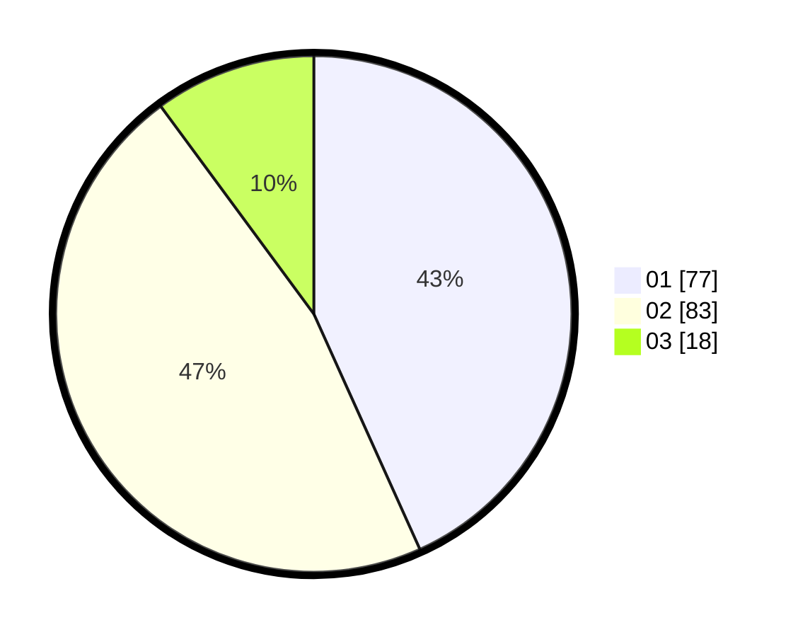

# Hasil

Hasil perolehan suara paslon dapat dilihat pada file paslon-01.txt, paslon-02.txt, dan paslon-03.txt.

Jika tidak ada, artinya data tersebut belum ada pada SIREKAP.

## Perolehan Suara

 * Paslon 01: **77**.
 * Paslon 02: **83**.
 * Paslon 03: **18**.

## Foto C Plano

https://sirekap-obj-formc.kpu.go.id/7936/pemilu/ppwp/31/73/04/10/07/3173041007030-20240214-185405--e0d7bfd7-f811-4df1-b503-a8a751c78cd3.jpg

https://sirekap-obj-formc.kpu.go.id/7936/pemilu/ppwp/31/73/04/10/07/3173041007030-20240214-202226--d2bc6bb4-6dde-4ee4-9987-75972fae08f5.jpg

https://sirekap-obj-formc.kpu.go.id/7936/pemilu/ppwp/31/73/04/10/07/3173041007030-20240214-200726--532d7071-dbf9-4527-914e-c60252b7ac92.jpg

## DATA PEMILIH TETAP

Jumlah pemilih dalam DPT: **287**.
 * L: **149**.
 * P: **138**.

## DATA PENGGUNA HAK PILIH

Jumlah pengguna hak pilih dalam DPT: **177**.
 * L: **88**.
 * P: **89**.

Jumlah pengguna hak pilih dalam DPTb: **0**.
 * L: **0**.
 * P: **0**.

Jumlah pengguna hak pilih dalam DPK: **4**.
 * L: **3**.
 * P: **1**.

Jumlah pengguna hak pilih: **182**.
 * L: **91**.
 * P: **90**.

## JUMLAH SUARA SAH DAN TIDAK SAH

JUMLAH SELURUH SUARA SAH: **178**.

JUMLAH SUARA TIDAK SAH: **4**.

JUMLAH SELURUH SUARA SAH DAN SUARA TIDAK SAH: **4**.
