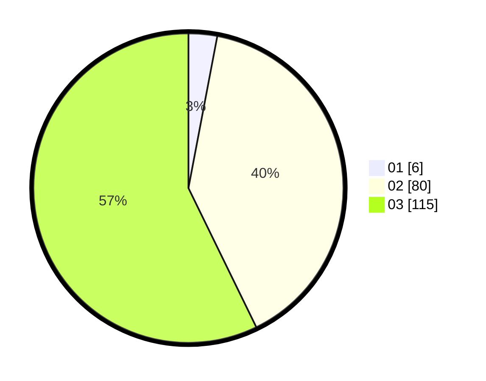

# Hasil

Hasil perolehan suara paslon dapat dilihat pada file paslon-01.txt, paslon-02.txt, dan paslon-03.txt.

Jika tidak ada, artinya data tersebut belum ada pada SIREKAP.

## Perolehan Suara

 * Paslon 01: **6**.
 * Paslon 02: **80**.
 * Paslon 03: **115**.

## Foto C Plano

https://sirekap-obj-formc.kpu.go.id/dee6/pemilu/ppwp/31/73/04/10/07/3173041007037-20240214-221646--6134a3d5-05a2-4eb2-a046-7fe805d5d0f2.jpg

https://sirekap-obj-formc.kpu.go.id/dee6/pemilu/ppwp/31/73/04/10/07/3173041007037-20240214-221709--1c90f696-7b3a-45ce-a063-20cb45a3deaf.jpg

https://sirekap-obj-formc.kpu.go.id/dee6/pemilu/ppwp/31/73/04/10/07/3173041007037-20240214-221720--a217e75c-5570-4cfc-b01c-a7b33ba24302.jpg
