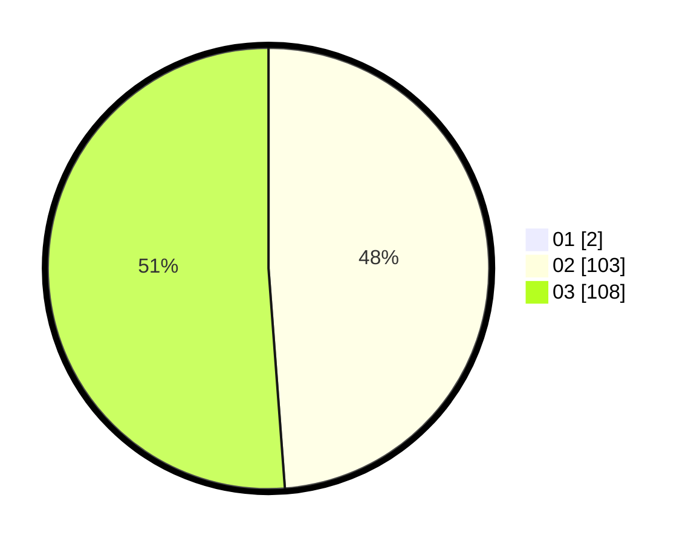

# Hasil

Hasil perolehan suara paslon dapat dilihat pada file paslon-01.txt, paslon-02.txt, dan paslon-03.txt.

Jika tidak ada, artinya data tersebut belum ada pada SIREKAP.

## Perolehan Suara

 * Paslon 01: **2**.
 * Paslon 02: **103**.
 * Paslon 03: **108**.

## Foto C Plano

https://sirekap-obj-formc.kpu.go.id/8d75/pemilu/ppwp/31/73/04/10/07/3173041007038-20240214-204247--f3a22ce2-dba7-4fa0-9ab5-6529ac988201.jpg

https://sirekap-obj-formc.kpu.go.id/8d75/pemilu/ppwp/31/73/04/10/07/3173041007038-20240214-204430--4cfdf650-47ca-4e54-b144-1f6efe70b574.jpg

https://sirekap-obj-formc.kpu.go.id/8d75/pemilu/ppwp/31/73/04/10/07/3173041007038-20240214-204556--06449c01-086c-4e4e-a401-589e870f9efe.jpg
