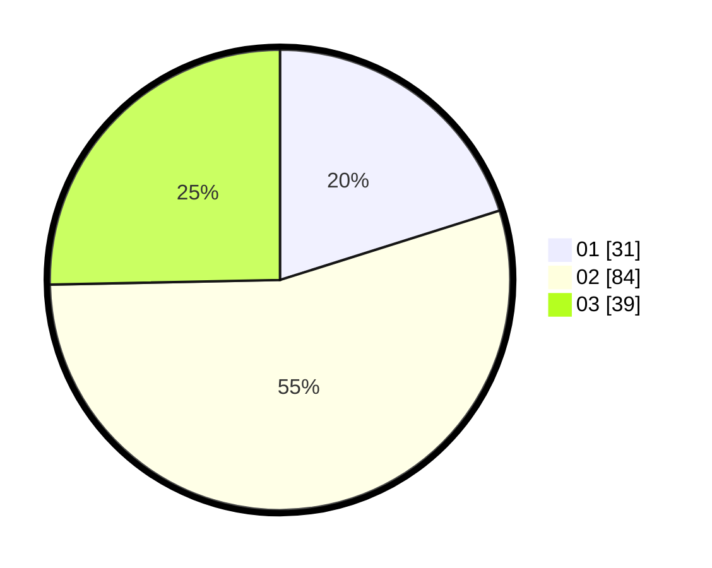

# Hasil

Hasil perolehan suara paslon dapat dilihat pada file paslon-01.txt, paslon-02.txt, dan paslon-03.txt.

Jika tidak ada, artinya data tersebut belum ada pada SIREKAP.

## Perolehan Suara

 * Paslon 01: **31**.
 * Paslon 02: **84**.
 * Paslon 03: **39**.

## Foto C Plano

https://sirekap-obj-formc.kpu.go.id/731f/pemilu/ppwp/31/73/04/10/07/3173041007040-20240214-230850--2e2ed643-1b89-4954-b81d-56ff98958e14.jpg

https://sirekap-obj-formc.kpu.go.id/731f/pemilu/ppwp/31/73/04/10/07/3173041007040-20240214-231044--81aea37b-f20f-48f1-8186-af5037ccb46e.jpg

https://sirekap-obj-formc.kpu.go.id/731f/pemilu/ppwp/31/73/04/10/07/3173041007040-20240214-231135--a12d73df-e80a-4eb8-a393-5a2cc270cab5.jpg

## DATA PEMILIH TETAP

Jumlah pemilih dalam DPT: **231**.
 * L: **110**.
 * P: **121**.

## DATA PENGGUNA HAK PILIH

Jumlah pengguna hak pilih dalam DPT: **152**.
 * L: **65**.
 * P: **87**.

Jumlah pengguna hak pilih dalam DPTb: **0**.
 * L: **0**.
 * P: **0**.

Jumlah pengguna hak pilih dalam DPK: **3**.
 * L: **1**.
 * P: **2**.

Jumlah pengguna hak pilih: **155**.
 * L: **66**.
 * P: **89**.

## JUMLAH SUARA SAH DAN TIDAK SAH

JUMLAH SELURUH SUARA SAH: **154**.

JUMLAH SUARA TIDAK SAH: **1**.

JUMLAH SELURUH SUARA SAH DAN SUARA TIDAK SAH: **155**.
