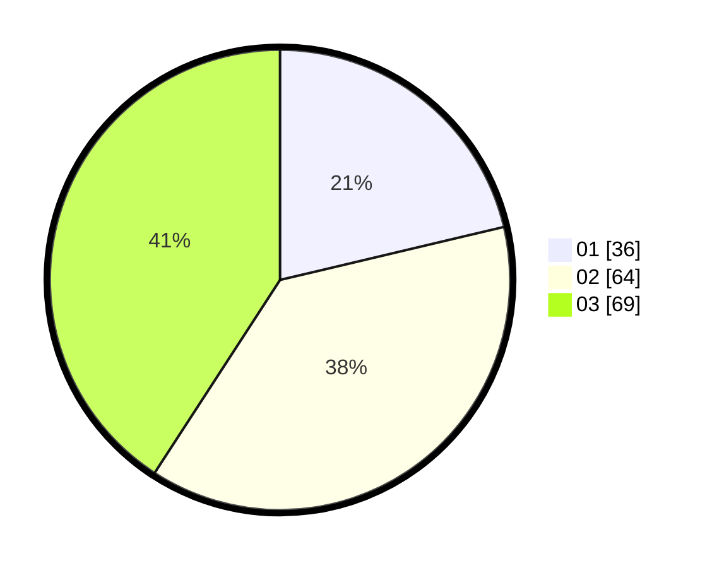

# Hasil

Hasil perolehan suara paslon dapat dilihat pada file paslon-01.txt, paslon-02.txt, dan paslon-03.txt.

Jika tidak ada, artinya data tersebut belum ada pada SIREKAP.

## Perolehan Suara

 * Paslon 01: **36**.
 * Paslon 02: **64**.
 * Paslon 03: **69**.

## Foto C Plano

https://sirekap-obj-formc.kpu.go.id/8e18/pemilu/ppwp/31/73/04/10/07/3173041007042-20240214-220731--a5e2ab1e-e01d-40aa-9dd0-b5ce2bcbf16b.jpg

https://sirekap-obj-formc.kpu.go.id/8e18/pemilu/ppwp/31/73/04/10/07/3173041007042-20240214-220826--61a38b86-a192-40f3-bfc4-d24ea8df1028.jpg
