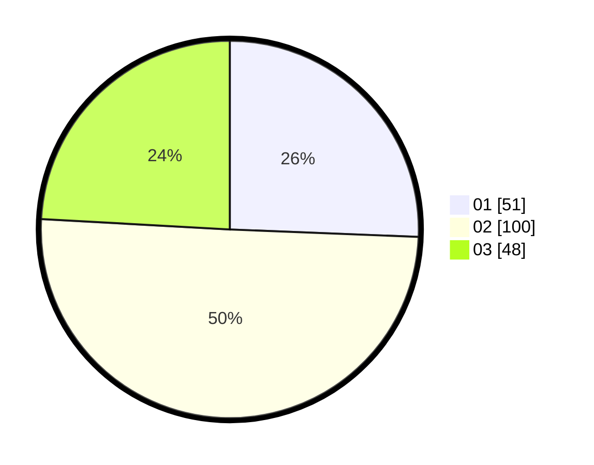

# Hasil

Hasil perolehan suara paslon dapat dilihat pada file paslon-01.txt, paslon-02.txt, dan paslon-03.txt.

Jika tidak ada, artinya data tersebut belum ada pada SIREKAP.

## Perolehan Suara

 * Paslon 01: **51**.
 * Paslon 02: **100**.
 * Paslon 03: **48**.

## Foto C Plano

https://sirekap-obj-formc.kpu.go.id/4caa/pemilu/ppwp/31/73/04/10/07/3173041007043-20240216-005207--6a40379a-c371-4ceb-aec6-1641e585974a.jpg

https://sirekap-obj-formc.kpu.go.id/4caa/pemilu/ppwp/31/73/04/10/07/3173041007043-20240216-005208--cac25fb2-6401-47dd-a19e-4fcdf40f484c.jpg

https://sirekap-obj-formc.kpu.go.id/4caa/pemilu/ppwp/31/73/04/10/07/3173041007043-20240216-005207--90a90ffe-0bf0-4e1a-8fff-300cf4fdd4d6.jpg

## DATA PEMILIH TETAP

Jumlah pemilih dalam DPT: **271**.
 * L: **133**.
 * P: **138**.

## DATA PENGGUNA HAK PILIH

Jumlah pengguna hak pilih dalam DPT: **189**.
 * L: **91**.
 * P: **98**.

Jumlah pengguna hak pilih dalam DPTb: **2**.
 * L: **1**.
 * P: **1**.

Jumlah pengguna hak pilih dalam DPK: **6**.
 * L: **1**.
 * P: **5**.

Jumlah pengguna hak pilih: **197**.
 * L: **93**.
 * P: **104**.

## JUMLAH SUARA SAH DAN TIDAK SAH

JUMLAH SELURUH SUARA SAH: **199**.

JUMLAH SUARA TIDAK SAH: **3**.

JUMLAH SELURUH SUARA SAH DAN SUARA TIDAK SAH: **202**.
