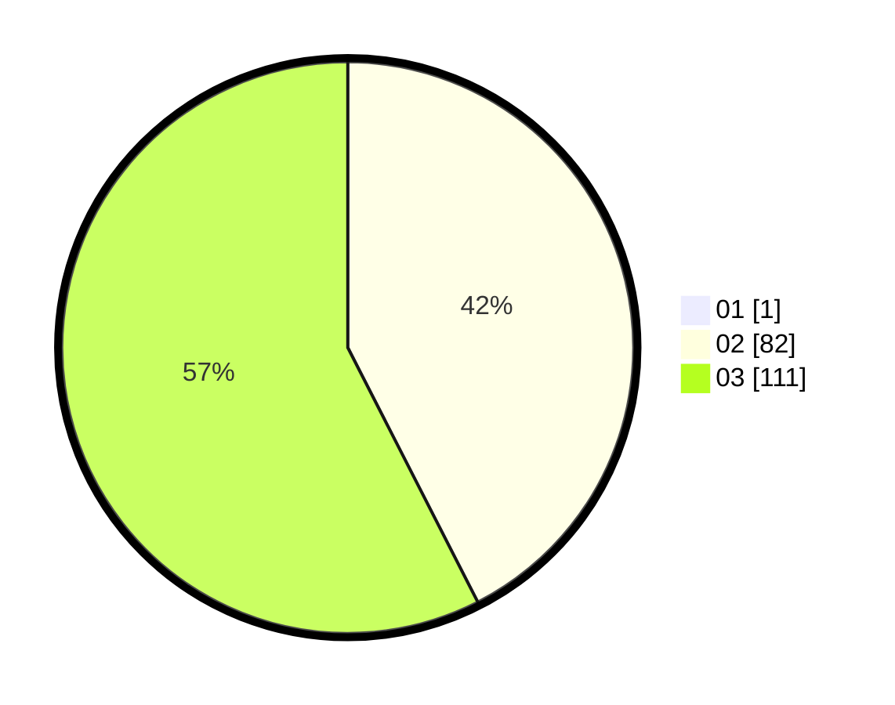

# Hasil

Hasil perolehan suara paslon dapat dilihat pada file paslon-01.txt, paslon-02.txt, dan paslon-03.txt.

Jika tidak ada, artinya data tersebut belum ada pada SIREKAP.

## Perolehan Suara

 * Paslon 01: **1**.
 * Paslon 02: **82**.
 * Paslon 03: **111**.

## Foto C Plano

https://sirekap-obj-formc.kpu.go.id/9f6b/pemilu/ppwp/31/73/04/10/07/3173041007046-20240214-200343--7bebf8ca-ec82-435b-b9cc-271aaf499b64.jpg

https://sirekap-obj-formc.kpu.go.id/9f6b/pemilu/ppwp/31/73/04/10/07/3173041007046-20240214-192225--666edd9b-282c-4b4f-80a5-6c2d39722139.jpg

https://sirekap-obj-formc.kpu.go.id/9f6b/pemilu/ppwp/31/73/04/10/07/3173041007046-20240214-191943--c9e09373-09f4-41a9-b8b3-a87635ff1f87.jpg

## DATA PEMILIH TETAP

Jumlah pemilih dalam DPT: **271**.
 * L: **127**.
 * P: **144**.

## DATA PENGGUNA HAK PILIH

Jumlah pengguna hak pilih dalam DPT: **195**.
 * L: **88**.
 * P: **107**.

Jumlah pengguna hak pilih dalam DPTb: **0**.
 * L: **0**.
 * P: **0**.

Jumlah pengguna hak pilih dalam DPK: **1**.
 * L: **1**.
 * P: **0**.

Jumlah pengguna hak pilih: **196**.
 * L: **89**.
 * P: **107**.

## JUMLAH SUARA SAH DAN TIDAK SAH

JUMLAH SELURUH SUARA SAH: **194**.

JUMLAH SUARA TIDAK SAH: **2**.

JUMLAH SELURUH SUARA SAH DAN SUARA TIDAK SAH: **196**.
