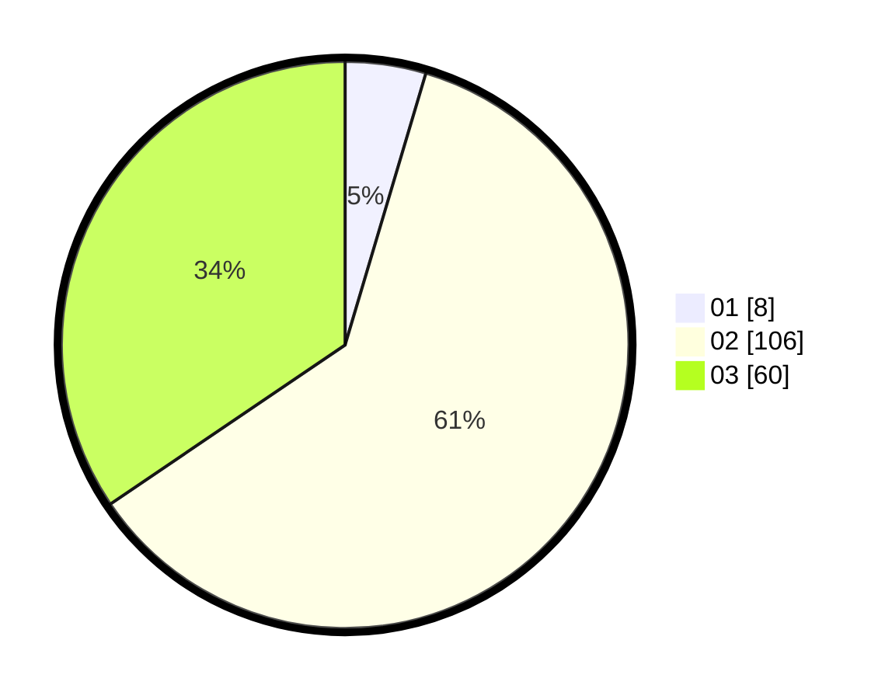

# Hasil

Hasil perolehan suara paslon dapat dilihat pada file paslon-01.txt, paslon-02.txt, dan paslon-03.txt.

Jika tidak ada, artinya data tersebut belum ada pada SIREKAP.

## Perolehan Suara

 * Paslon 01: **8**.
 * Paslon 02: **106**.
 * Paslon 03: **60**.

## Foto C Plano

https://sirekap-obj-formc.kpu.go.id/0b8d/pemilu/ppwp/31/73/04/10/07/3173041007047-20240214-204424--847fb51a-9f22-4e26-8c4f-d4991fa4516f.jpg

https://sirekap-obj-formc.kpu.go.id/0b8d/pemilu/ppwp/31/73/04/10/07/3173041007047-20240214-204820--622c4fc9-96ea-4010-b2b0-cafbfdd1427d.jpg

https://sirekap-obj-formc.kpu.go.id/0b8d/pemilu/ppwp/31/73/04/10/07/3173041007047-20240214-205334--19c687b8-f21d-44be-8b5c-1d325c3453ff.jpg

## DATA PEMILIH TETAP

Jumlah pemilih dalam DPT: **247**.
 * L: **115**.
 * P: **132**.

## DATA PENGGUNA HAK PILIH

Jumlah pengguna hak pilih dalam DPT: **179**.
 * L: **99**.
 * P: **80**.

Jumlah pengguna hak pilih dalam DPTb: **0**.
 * L: **0**.
 * P: **0**.

Jumlah pengguna hak pilih dalam DPK: **0**.
 * L: **0**.
 * P: **0**.

Jumlah pengguna hak pilih: **179**.
 * L: **99**.
 * P: **80**.

## JUMLAH SUARA SAH DAN TIDAK SAH

JUMLAH SELURUH SUARA SAH: **179**.

JUMLAH SUARA TIDAK SAH: **6**.

JUMLAH SELURUH SUARA SAH DAN SUARA TIDAK SAH: **185**.
