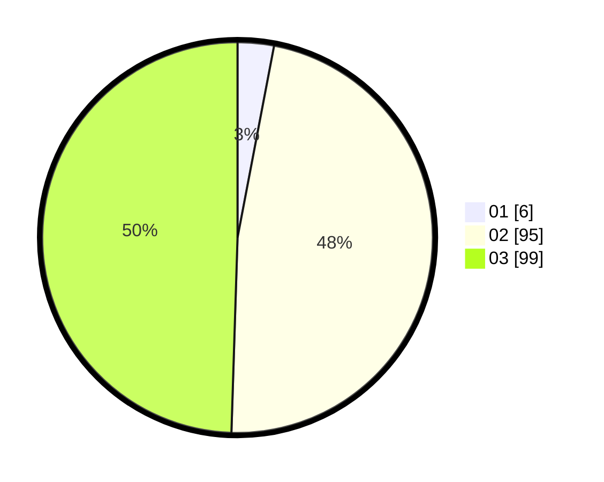

# Hasil

Hasil perolehan suara paslon dapat dilihat pada file paslon-01.txt, paslon-02.txt, dan paslon-03.txt.

Jika tidak ada, artinya data tersebut belum ada pada SIREKAP.

## Perolehan Suara

 * Paslon 01: **6**.
 * Paslon 02: **95**.
 * Paslon 03: **99**.

## Foto C Plano

https://sirekap-obj-formc.kpu.go.id/0139/pemilu/ppwp/31/73/04/10/07/3173041007048-20240214-193120--cddc2fcd-e379-41ee-b9f8-93f3bdffd791.jpg

https://sirekap-obj-formc.kpu.go.id/0139/pemilu/ppwp/31/73/04/10/07/3173041007048-20240214-194641--173d0d79-e18f-4c39-9622-bbe45011a617.jpg

https://sirekap-obj-formc.kpu.go.id/0139/pemilu/ppwp/31/73/04/10/07/3173041007048-20240214-195111--75b3b261-2dd0-451c-9a62-c1325583762c.jpg
