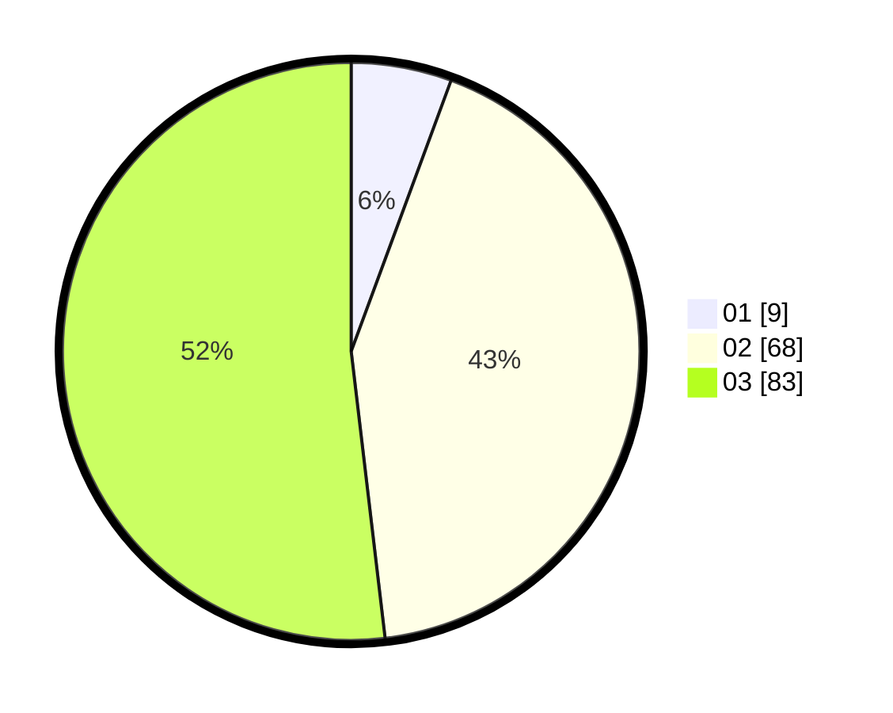

# Hasil

Hasil perolehan suara paslon dapat dilihat pada file paslon-01.txt, paslon-02.txt, dan paslon-03.txt.

Jika tidak ada, artinya data tersebut belum ada pada SIREKAP.

## Perolehan Suara

 * Paslon 01: **9**.
 * Paslon 02: **68**.
 * Paslon 03: **83**.

## Foto C Plano

https://sirekap-obj-formc.kpu.go.id/fee4/pemilu/ppwp/31/73/04/10/07/3173041007049-20240215-072438--d03a0c64-8841-4563-8482-b45b19867445.jpg

https://sirekap-obj-formc.kpu.go.id/fee4/pemilu/ppwp/31/73/04/10/07/3173041007049-20240215-072457--9b789652-338b-422c-9bb8-8334eb794c65.jpg

https://sirekap-obj-formc.kpu.go.id/fee4/pemilu/ppwp/31/73/04/10/07/3173041007049-20240215-072513--8b80b803-8919-4cd5-87fb-614e609f77e1.jpg
