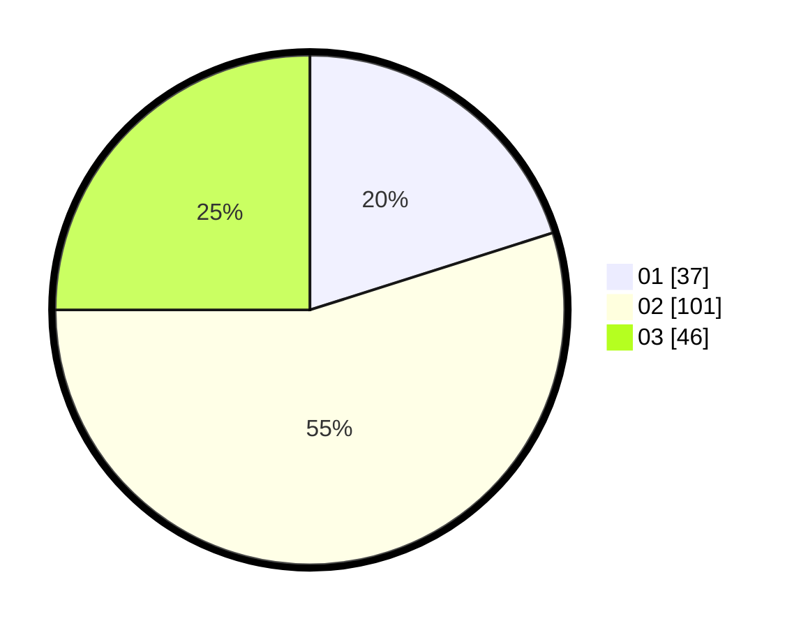

# Hasil

Hasil perolehan suara paslon dapat dilihat pada file paslon-01.txt, paslon-02.txt, dan paslon-03.txt.

Jika tidak ada, artinya data tersebut belum ada pada SIREKAP.

## Perolehan Suara

 * Paslon 01: **37**.
 * Paslon 02: **101**.
 * Paslon 03: **46**.

## Foto C Plano

https://sirekap-obj-formc.kpu.go.id/5479/pemilu/ppwp/31/73/04/10/07/3173041007053-20240216-012830--274ca760-8aad-4cb8-a07b-6c9d7d4935e3.jpg

https://sirekap-obj-formc.kpu.go.id/5479/pemilu/ppwp/31/73/04/10/07/3173041007053-20240214-201019--b472e6c9-c63c-42a1-a9e4-17396e8e3e6a.jpg

https://sirekap-obj-formc.kpu.go.id/5479/pemilu/ppwp/31/73/04/10/07/3173041007053-20240214-201101--44296fa9-337c-4b59-896a-db6307dbda56.jpg

## DATA PEMILIH TETAP

Jumlah pemilih dalam DPT: **265**.
 * L: **129**.
 * P: **136**.

## DATA PENGGUNA HAK PILIH

Jumlah pengguna hak pilih dalam DPT: **186**.
 * L: **96**.
 * P: **90**.

Jumlah pengguna hak pilih dalam DPTb: **0**.
 * L: **0**.
 * P: **0**.

Jumlah pengguna hak pilih dalam DPK: **1**.
 * L: **0**.
 * P: **1**.

Jumlah pengguna hak pilih: **187**.
 * L: **96**.
 * P: **91**.

## JUMLAH SUARA SAH DAN TIDAK SAH

JUMLAH SELURUH SUARA SAH: **184**.

JUMLAH SUARA TIDAK SAH: **3**.

JUMLAH SELURUH SUARA SAH DAN SUARA TIDAK SAH: **187**.
