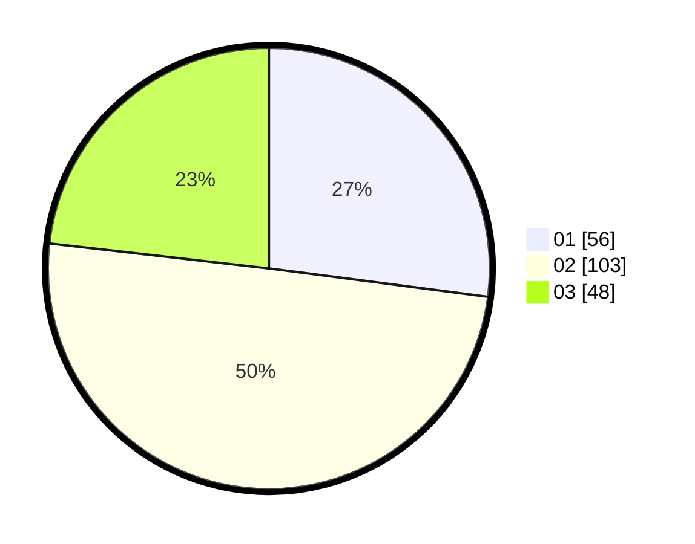

# Hasil

Hasil perolehan suara paslon dapat dilihat pada file paslon-01.txt, paslon-02.txt, dan paslon-03.txt.

Jika tidak ada, artinya data tersebut belum ada pada SIREKAP.

## Perolehan Suara

 * Paslon 01: **56**.
 * Paslon 02: **103**.
 * Paslon 03: **48**.

## Foto C Plano

https://sirekap-obj-formc.kpu.go.id/d529/pemilu/ppwp/31/73/04/10/07/3173041007055-20240215-204251--71ef2ebe-1d37-4576-9867-952a832b12cf.jpg

https://sirekap-obj-formc.kpu.go.id/d529/pemilu/ppwp/31/73/04/10/07/3173041007055-20240214-192150--ccde518c-c267-44b3-976d-344236721e27.jpg

https://sirekap-obj-formc.kpu.go.id/d529/pemilu/ppwp/31/73/04/10/07/3173041007055-20240214-192216--d02279dc-fafa-4336-9791-7ca3dbf492ad.jpg

## DATA PEMILIH TETAP

Jumlah pemilih dalam DPT: **257**.
 * L: **132**.
 * P: **125**.

## DATA PENGGUNA HAK PILIH

Jumlah pengguna hak pilih dalam DPT: **207**.
 * L: **107**.
 * P: **100**.

Jumlah pengguna hak pilih dalam DPTb: **2**.
 * L: **1**.
 * P: **1**.

Jumlah pengguna hak pilih dalam DPK: **0**.
 * L: **0**.
 * P: **0**.

Jumlah pengguna hak pilih: **209**.
 * L: **108**.
 * P: **101**.

## JUMLAH SUARA SAH DAN TIDAK SAH

JUMLAH SELURUH SUARA SAH: **207**.

JUMLAH SUARA TIDAK SAH: **2**.

JUMLAH SELURUH SUARA SAH DAN SUARA TIDAK SAH: **209**.
