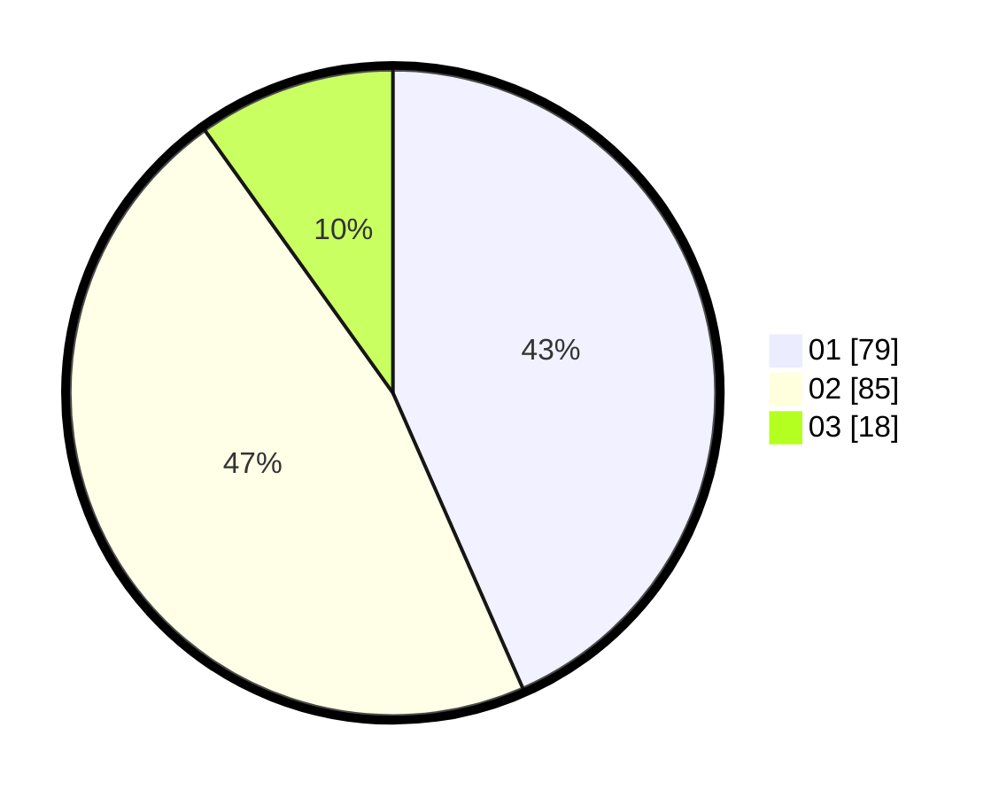

# Hasil

Hasil perolehan suara paslon dapat dilihat pada file paslon-01.txt, paslon-02.txt, dan paslon-03.txt.

Jika tidak ada, artinya data tersebut belum ada pada SIREKAP.

## Perolehan Suara

 * Paslon 01: **79**.
 * Paslon 02: **85**.
 * Paslon 03: **18**.

## Foto C Plano

https://sirekap-obj-formc.kpu.go.id/7fe6/pemilu/ppwp/31/73/04/10/07/3173041007057-20240214-232701--76e33860-e064-4cc4-b4ee-919c4c5bfb1c.jpg

https://sirekap-obj-formc.kpu.go.id/7fe6/pemilu/ppwp/31/73/04/10/07/3173041007057-20240214-232914--78b7ac21-34d6-4897-b903-ea92b86ff55c.jpg

https://sirekap-obj-formc.kpu.go.id/7fe6/pemilu/ppwp/31/73/04/10/07/3173041007057-20240214-233120--f082937a-298d-44c8-b723-eea8b84b9254.jpg

## DATA PEMILIH TETAP

Jumlah pemilih dalam DPT: **267**.
 * L: **149**.
 * P: **118**.

## DATA PENGGUNA HAK PILIH

Jumlah pengguna hak pilih dalam DPT: **187**.
 * L: **103**.
 * P: **84**.

Jumlah pengguna hak pilih dalam DPTb: **0**.
 * L: **0**.
 * P: **0**.

Jumlah pengguna hak pilih dalam DPK: **0**.
 * L: **0**.
 * P: **0**.

Jumlah pengguna hak pilih: **187**.
 * L: **103**.
 * P: **84**.

## JUMLAH SUARA SAH DAN TIDAK SAH

JUMLAH SELURUH SUARA SAH: **182**.

JUMLAH SUARA TIDAK SAH: **5**.

JUMLAH SELURUH SUARA SAH DAN SUARA TIDAK SAH: **187**.
