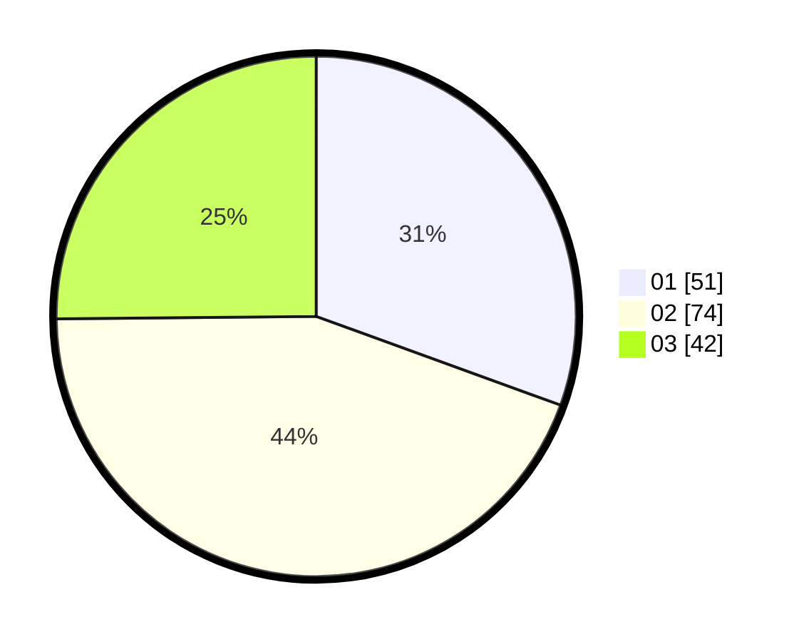

# Hasil

Hasil perolehan suara paslon dapat dilihat pada file paslon-01.txt, paslon-02.txt, dan paslon-03.txt.

Jika tidak ada, artinya data tersebut belum ada pada SIREKAP.

## Perolehan Suara

 * Paslon 01: **51**.
 * Paslon 02: **74**.
 * Paslon 03: **42**.

## Foto C Plano

https://sirekap-obj-formc.kpu.go.id/ab36/pemilu/ppwp/31/73/04/10/07/3173041007060-20240214-204819--92b3b0a0-9863-4c53-bbe4-aa3191c74d89.jpg

https://sirekap-obj-formc.kpu.go.id/ab36/pemilu/ppwp/31/73/04/10/07/3173041007060-20240214-205003--7d5c5bb0-76c9-44d8-aeef-9b63f5dc3963.jpg

https://sirekap-obj-formc.kpu.go.id/ab36/pemilu/ppwp/31/73/04/10/07/3173041007060-20240214-205144--315ca4df-0f62-4cb7-89df-50557fbb7ba1.jpg
