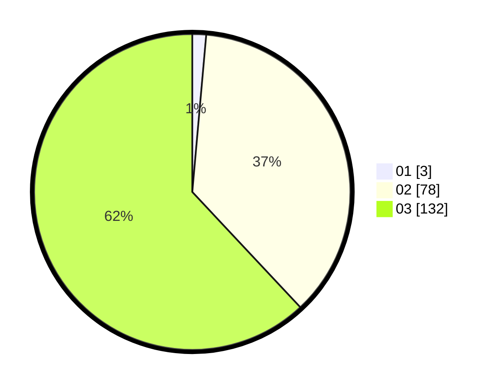

# Hasil

Hasil perolehan suara paslon dapat dilihat pada file paslon-01.txt, paslon-02.txt, dan paslon-03.txt.

Jika tidak ada, artinya data tersebut belum ada pada SIREKAP.

## Perolehan Suara

 * Paslon 01: **3**.
 * Paslon 02: **78**.
 * Paslon 03: **132**.

## Foto C Plano

https://sirekap-obj-formc.kpu.go.id/e4f2/pemilu/ppwp/31/73/04/10/07/3173041007062-20240215-001040--ef1b4977-c084-447f-a0cd-fd943dfba422.jpg

https://sirekap-obj-formc.kpu.go.id/e4f2/pemilu/ppwp/31/73/04/10/07/3173041007062-20240214-202858--b53ab701-2cd5-4798-bfd5-fd3e4b77f250.jpg

https://sirekap-obj-formc.kpu.go.id/e4f2/pemilu/ppwp/31/73/04/10/07/3173041007062-20240214-213534--f4ca9391-07d3-4b4b-86a6-ada4b8518235.jpg
