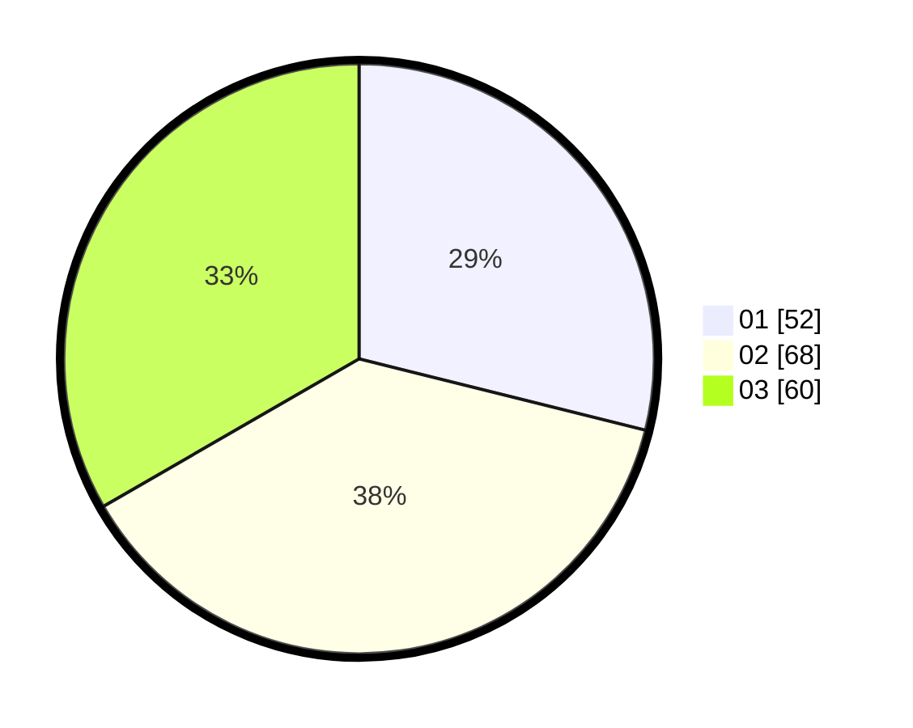

# Hasil

Hasil perolehan suara paslon dapat dilihat pada file paslon-01.txt, paslon-02.txt, dan paslon-03.txt.

Jika tidak ada, artinya data tersebut belum ada pada SIREKAP.

## Perolehan Suara

 * Paslon 01: **52**.
 * Paslon 02: **68**.
 * Paslon 03: **60**.

## Foto C Plano

https://sirekap-obj-formc.kpu.go.id/8192/pemilu/ppwp/31/73/04/10/07/3173041007065-20240214-224942--400772e7-1b28-40e7-ad7c-d38da16e3c4b.jpg

https://sirekap-obj-formc.kpu.go.id/8192/pemilu/ppwp/31/73/04/10/07/3173041007065-20240214-225106--fd9dc32e-7071-400b-b0b0-6a2fcb55ae58.jpg

https://sirekap-obj-formc.kpu.go.id/8192/pemilu/ppwp/31/73/04/10/07/3173041007065-20240214-225255--4faf9d8b-357d-4bc7-af62-c16c0b3f7c97.jpg
