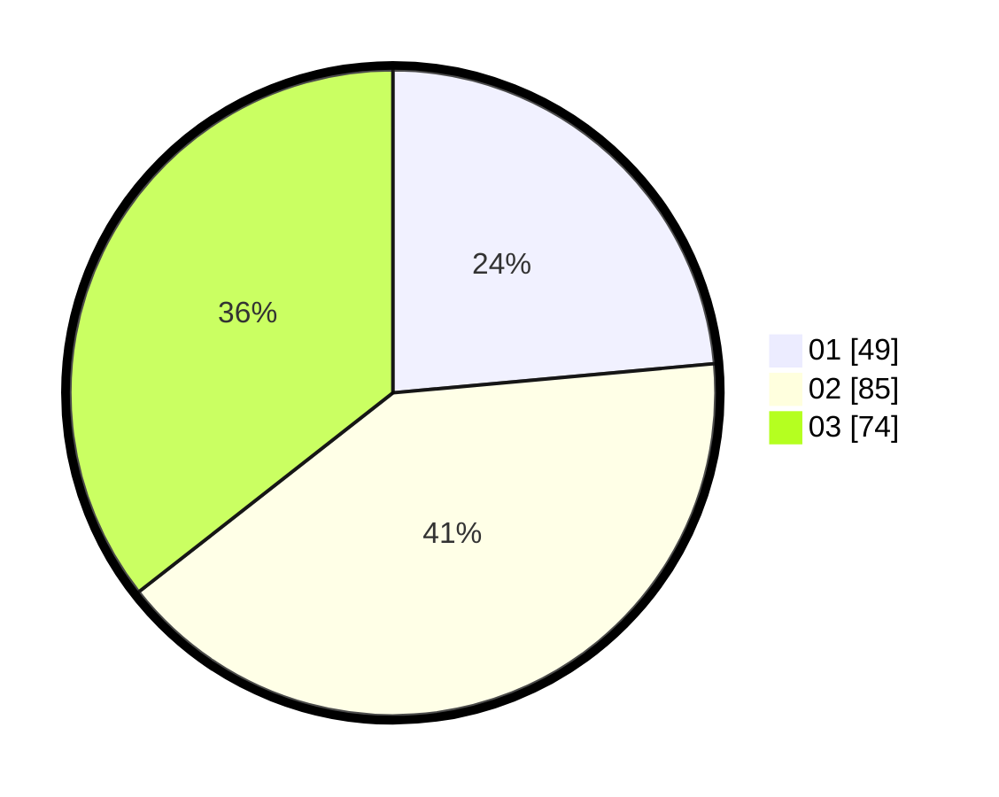

# Hasil

Hasil perolehan suara paslon dapat dilihat pada file paslon-01.txt, paslon-02.txt, dan paslon-03.txt.

Jika tidak ada, artinya data tersebut belum ada pada SIREKAP.

## Perolehan Suara

 * Paslon 01: **49**.
 * Paslon 02: **85**.
 * Paslon 03: **74**.

## Foto C Plano

https://sirekap-obj-formc.kpu.go.id/061a/pemilu/ppwp/31/73/04/10/07/3173041007066-20240214-221600--a9a10ad9-01d7-41b4-a49c-c7f86c6385a7.jpg

https://sirekap-obj-formc.kpu.go.id/061a/pemilu/ppwp/31/73/04/10/07/3173041007066-20240214-211437--ec267edb-77c5-4e88-ac78-928f2234b0d5.jpg
