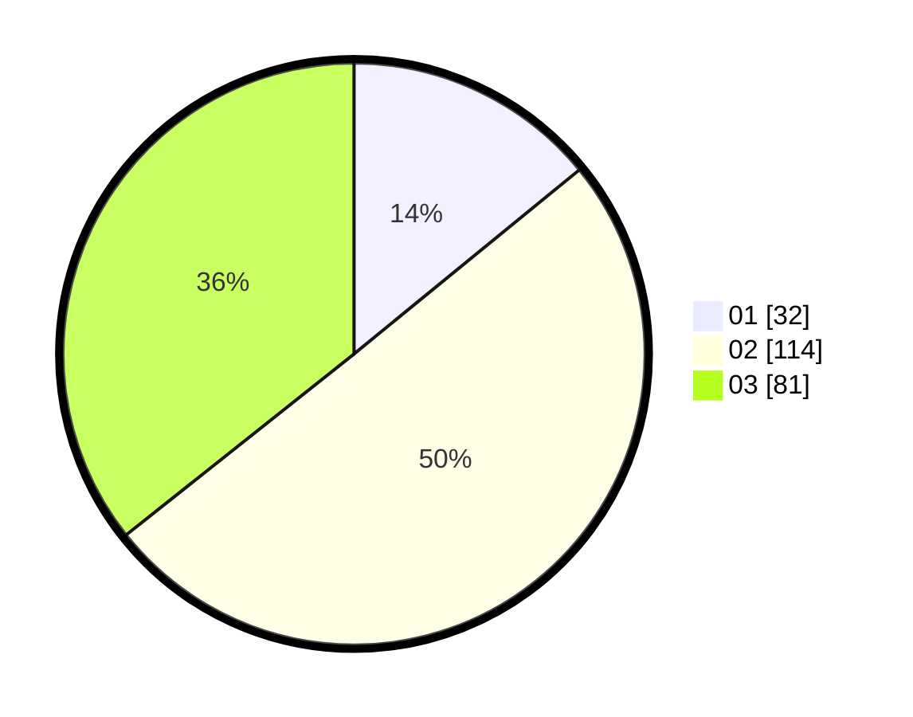

# Hasil

Hasil perolehan suara paslon dapat dilihat pada file paslon-01.txt, paslon-02.txt, dan paslon-03.txt.

Jika tidak ada, artinya data tersebut belum ada pada SIREKAP.

## Perolehan Suara

 * Paslon 01: **32**.
 * Paslon 02: **114**.
 * Paslon 03: **81**.

## Foto C Plano

https://sirekap-obj-formc.kpu.go.id/f9d4/pemilu/ppwp/31/73/04/10/07/3173041007069-20240214-194433--cbe12d13-011f-434a-bdaa-eb352011b59b.jpg

https://sirekap-obj-formc.kpu.go.id/f9d4/pemilu/ppwp/31/73/04/10/07/3173041007069-20240214-194455--2ce4a5c8-53af-4f81-847c-a1e3a9cb891c.jpg

https://sirekap-obj-formc.kpu.go.id/f9d4/pemilu/ppwp/31/73/04/10/07/3173041007069-20240214-194501--35c94e65-2735-41a7-a1c1-d3f085d39213.jpg

## DATA PEMILIH TETAP

Jumlah pemilih dalam DPT: **271**.
 * L: **132**.
 * P: **139**.

## DATA PENGGUNA HAK PILIH

Jumlah pengguna hak pilih dalam DPT: **227**.
 * L: **116**.
 * P: **111**.

Jumlah pengguna hak pilih dalam DPTb: **3**.
 * L: **2**.
 * P: **1**.

Jumlah pengguna hak pilih dalam DPK: **3**.
 * L: **2**.
 * P: **1**.

Jumlah pengguna hak pilih: **233**.
 * L: **120**.
 * P: **113**.

## JUMLAH SUARA SAH DAN TIDAK SAH

JUMLAH SELURUH SUARA SAH: **227**.

JUMLAH SUARA TIDAK SAH: **6**.

JUMLAH SELURUH SUARA SAH DAN SUARA TIDAK SAH: **233**.
