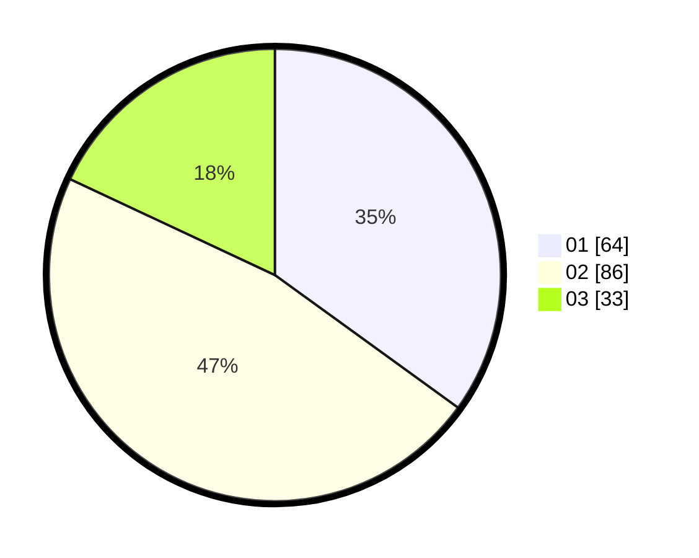

# Hasil

Hasil perolehan suara paslon dapat dilihat pada file paslon-01.txt, paslon-02.txt, dan paslon-03.txt.

Jika tidak ada, artinya data tersebut belum ada pada SIREKAP.

## Perolehan Suara

 * Paslon 01: **64**.
 * Paslon 02: **86**.
 * Paslon 03: **33**.

## Foto C Plano

https://sirekap-obj-formc.kpu.go.id/476c/pemilu/ppwp/31/73/04/10/07/3173041007071-20240214-201516--68bc8f84-6a94-46c7-ae10-275afcb40122.jpg

https://sirekap-obj-formc.kpu.go.id/476c/pemilu/ppwp/31/73/04/10/07/3173041007071-20240214-193530--1a3aa285-5ab3-4c3c-9d47-4436efb46abe.jpg

https://sirekap-obj-formc.kpu.go.id/476c/pemilu/ppwp/31/73/04/10/07/3173041007071-20240214-201723--e8816773-d355-4986-93dd-bded75db0214.jpg

## DATA PEMILIH TETAP

Jumlah pemilih dalam DPT: **244**.
 * L: **114**.
 * P: **130**.

## DATA PENGGUNA HAK PILIH

Jumlah pengguna hak pilih dalam DPT: **188**.
 * L: **83**.
 * P: **105**.

Jumlah pengguna hak pilih dalam DPTb: **0**.
 * L: **0**.
 * P: **0**.

Jumlah pengguna hak pilih dalam DPK: **0**.
 * L: **0**.
 * P: **0**.

Jumlah pengguna hak pilih: **188**.
 * L: **83**.
 * P: **105**.

## JUMLAH SUARA SAH DAN TIDAK SAH

JUMLAH SELURUH SUARA SAH: **183**.

JUMLAH SUARA TIDAK SAH: **5**.

JUMLAH SELURUH SUARA SAH DAN SUARA TIDAK SAH: **188**.
