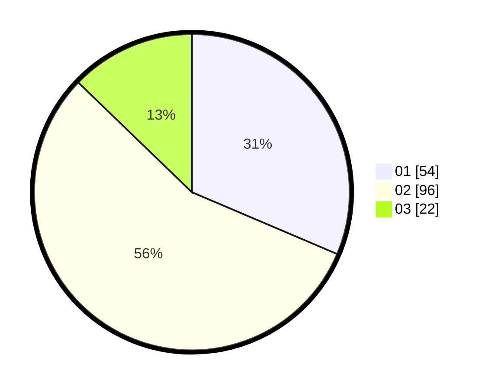

# Hasil

Hasil perolehan suara paslon dapat dilihat pada file paslon-01.txt, paslon-02.txt, dan paslon-03.txt.

Jika tidak ada, artinya data tersebut belum ada pada SIREKAP.

## Perolehan Suara

 * Paslon 01: **54**.
 * Paslon 02: **96**.
 * Paslon 03: **22**.

## Foto C Plano

https://sirekap-obj-formc.kpu.go.id/aa8e/pemilu/ppwp/31/73/04/10/07/3173041007072-20240214-192220--5f5286c1-fc75-4ed2-8aa3-bb5b8c55ccf8.jpg

https://sirekap-obj-formc.kpu.go.id/aa8e/pemilu/ppwp/31/73/04/10/07/3173041007072-20240214-224438--2051134b-8f74-4ea0-ac6e-e9a3eb0df434.jpg

https://sirekap-obj-formc.kpu.go.id/aa8e/pemilu/ppwp/31/73/04/10/07/3173041007072-20240214-193206--e054a101-f582-4e85-a96b-a9a91a30463f.jpg

## DATA PEMILIH TETAP

Jumlah pemilih dalam DPT: **239**.
 * L: **120**.
 * P: **119**.

## DATA PENGGUNA HAK PILIH

Jumlah pengguna hak pilih dalam DPT: **175**.
 * L: **87**.
 * P: **88**.

Jumlah pengguna hak pilih dalam DPTb: **0**.
 * L: **0**.
 * P: **0**.

Jumlah pengguna hak pilih dalam DPK: **1**.
 * L: **0**.
 * P: **1**.

Jumlah pengguna hak pilih: **176**.
 * L: **87**.
 * P: **89**.

## JUMLAH SUARA SAH DAN TIDAK SAH

JUMLAH SELURUH SUARA SAH: **172**.

JUMLAH SUARA TIDAK SAH: **4**.

JUMLAH SELURUH SUARA SAH DAN SUARA TIDAK SAH: **176**.
