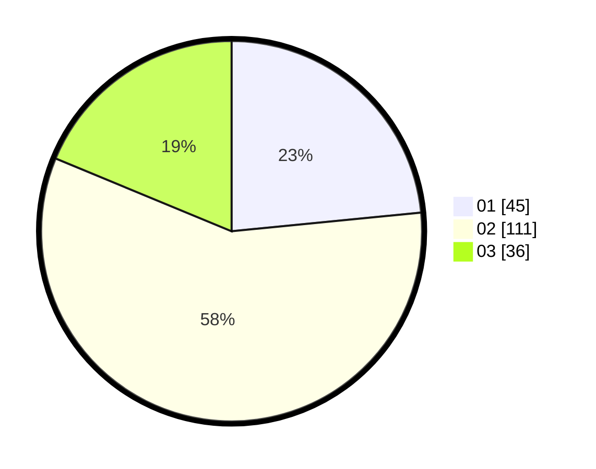

# Hasil

Hasil perolehan suara paslon dapat dilihat pada file paslon-01.txt, paslon-02.txt, dan paslon-03.txt.

Jika tidak ada, artinya data tersebut belum ada pada SIREKAP.

## Perolehan Suara

 * Paslon 01: **45**.
 * Paslon 02: **111**.
 * Paslon 03: **36**.

## Foto C Plano

https://sirekap-obj-formc.kpu.go.id/4a48/pemilu/ppwp/31/73/04/10/07/3173041007073-20240214-221801--3d959ca8-29c1-4ad9-bf4f-5e6a1b50945c.jpg

https://sirekap-obj-formc.kpu.go.id/4a48/pemilu/ppwp/31/73/04/10/07/3173041007073-20240214-223228--61285d10-5f63-4040-bdee-3d047afb6a02.jpg

https://sirekap-obj-formc.kpu.go.id/4a48/pemilu/ppwp/31/73/04/10/07/3173041007073-20240214-202731--b1d7c59f-9b75-452d-b829-6a2e388b217b.jpg

## DATA PEMILIH TETAP

Jumlah pemilih dalam DPT: **238**.
 * L: **113**.
 * P: **125**.

## DATA PENGGUNA HAK PILIH

Jumlah pengguna hak pilih dalam DPT: **194**.
 * L: **85**.
 * P: **109**.

Jumlah pengguna hak pilih dalam DPTb: **0**.
 * L: **0**.
 * P: **0**.

Jumlah pengguna hak pilih dalam DPK: **0**.
 * L: **0**.
 * P: **0**.

Jumlah pengguna hak pilih: **194**.
 * L: **85**.
 * P: **109**.

## JUMLAH SUARA SAH DAN TIDAK SAH

JUMLAH SELURUH SUARA SAH: **192**.

JUMLAH SUARA TIDAK SAH: **2**.

JUMLAH SELURUH SUARA SAH DAN SUARA TIDAK SAH: **194**.
