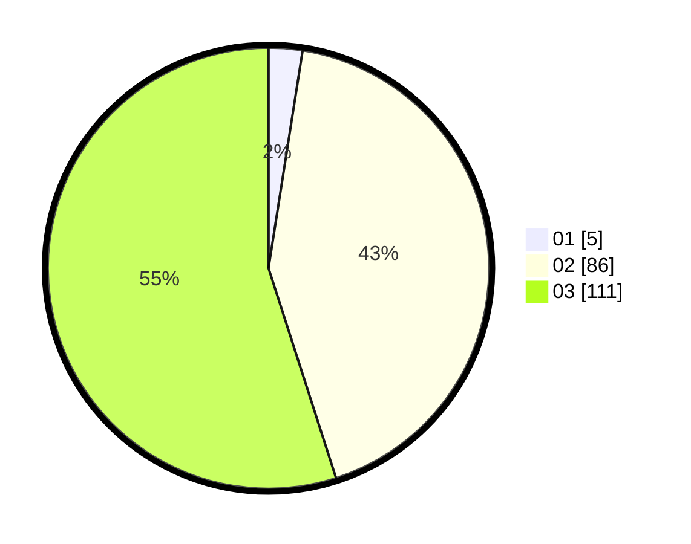

# Hasil

Hasil perolehan suara paslon dapat dilihat pada file paslon-01.txt, paslon-02.txt, dan paslon-03.txt.

Jika tidak ada, artinya data tersebut belum ada pada SIREKAP.

## Perolehan Suara

 * Paslon 01: **5**.
 * Paslon 02: **86**.
 * Paslon 03: **111**.

## Foto C Plano

https://sirekap-obj-formc.kpu.go.id/7449/pemilu/ppwp/31/73/04/10/07/3173041007076-20240214-205953--9883a1be-9cec-4c2d-99b1-b6664df24c90.jpg

https://sirekap-obj-formc.kpu.go.id/7449/pemilu/ppwp/31/73/04/10/07/3173041007076-20240214-210118--799c9e44-49f2-4979-ab81-5bfd7fd0ee41.jpg

https://sirekap-obj-formc.kpu.go.id/7449/pemilu/ppwp/31/73/04/10/07/3173041007076-20240214-210224--d24fc833-5308-4443-a4c9-a6a7398d7486.jpg

## DATA PEMILIH TETAP

Jumlah pemilih dalam DPT: **265**.
 * L: **136**.
 * P: **129**.

## DATA PENGGUNA HAK PILIH

Jumlah pengguna hak pilih dalam DPT: **200**.
 * L: **101**.
 * P: **99**.

Jumlah pengguna hak pilih dalam DPTb: **0**.
 * L: **0**.
 * P: **0**.

Jumlah pengguna hak pilih dalam DPK: **2**.
 * L: **1**.
 * P: **1**.

Jumlah pengguna hak pilih: **202**.
 * L: **102**.
 * P: **100**.

## JUMLAH SUARA SAH DAN TIDAK SAH

JUMLAH SELURUH SUARA SAH: **202**.

JUMLAH SUARA TIDAK SAH: **0**.

JUMLAH SELURUH SUARA SAH DAN SUARA TIDAK SAH: **202**.
