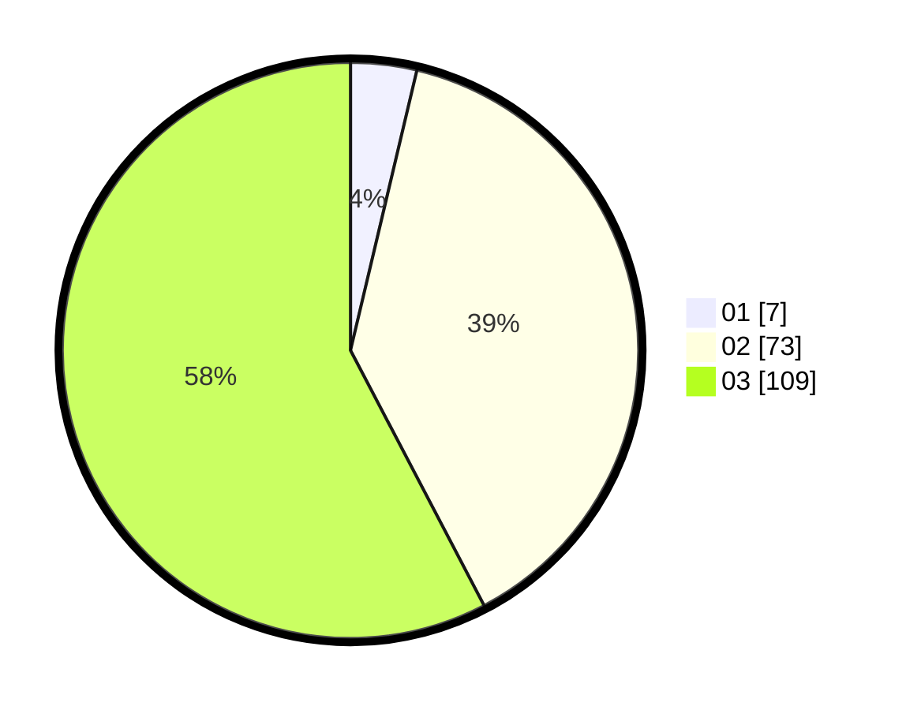

# Hasil

Hasil perolehan suara paslon dapat dilihat pada file paslon-01.txt, paslon-02.txt, dan paslon-03.txt.

Jika tidak ada, artinya data tersebut belum ada pada SIREKAP.

## Perolehan Suara

 * Paslon 01: **7**.
 * Paslon 02: **73**.
 * Paslon 03: **109**.

## Foto C Plano

https://sirekap-obj-formc.kpu.go.id/58d0/pemilu/ppwp/31/73/04/10/07/3173041007077-20240214-200921--88f37d09-20af-437c-b574-74e769a00bbf.jpg

https://sirekap-obj-formc.kpu.go.id/58d0/pemilu/ppwp/31/73/04/10/07/3173041007077-20240214-201434--6e19a8db-453b-4537-a9d1-c1bd00802c41.jpg

https://sirekap-obj-formc.kpu.go.id/58d0/pemilu/ppwp/31/73/04/10/07/3173041007077-20240214-201607--ea002655-a023-4b91-9e37-ae80a9d74932.jpg

## DATA PEMILIH TETAP

Jumlah pemilih dalam DPT: **263**.
 * L: **129**.
 * P: **134**.

## DATA PENGGUNA HAK PILIH

Jumlah pengguna hak pilih dalam DPT: **191**.
 * L: **95**.
 * P: **96**.

Jumlah pengguna hak pilih dalam DPTb: **0**.
 * L: **0**.
 * P: **0**.

Jumlah pengguna hak pilih dalam DPK: **1**.
 * L: **0**.
 * P: **1**.

Jumlah pengguna hak pilih: **192**.
 * L: **95**.
 * P: **97**.

## JUMLAH SUARA SAH DAN TIDAK SAH

JUMLAH SELURUH SUARA SAH: **189**.

JUMLAH SUARA TIDAK SAH: **3**.

JUMLAH SELURUH SUARA SAH DAN SUARA TIDAK SAH: **192**.
