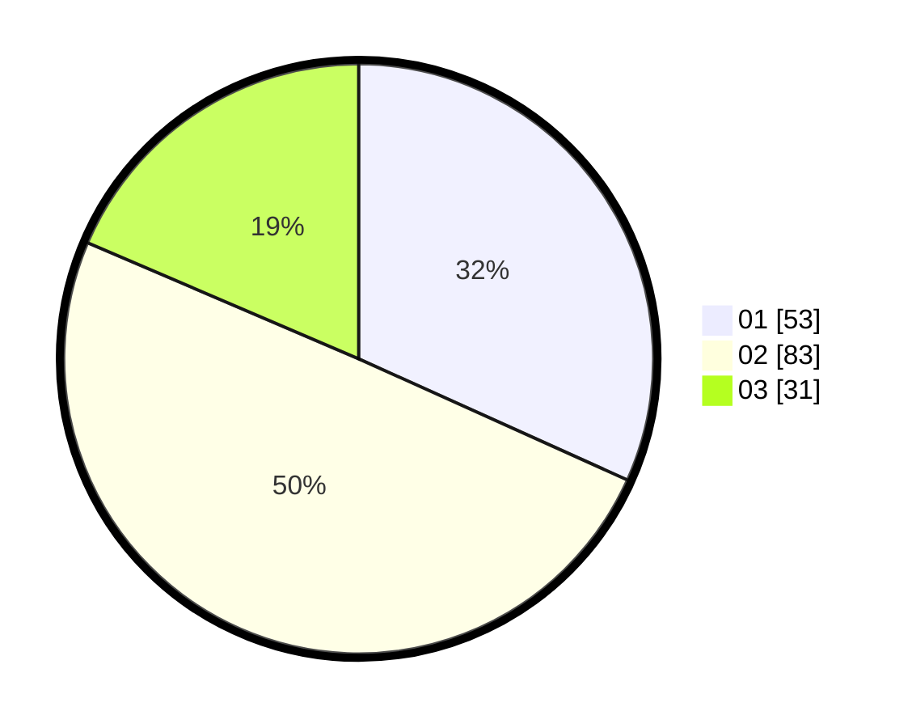

# Hasil

Hasil perolehan suara paslon dapat dilihat pada file paslon-01.txt, paslon-02.txt, dan paslon-03.txt.

Jika tidak ada, artinya data tersebut belum ada pada SIREKAP.

## Perolehan Suara

 * Paslon 01: **53**.
 * Paslon 02: **83**.
 * Paslon 03: **31**.

## Foto C Plano

https://sirekap-obj-formc.kpu.go.id/12a9/pemilu/ppwp/31/73/04/10/07/3173041007080-20240214-211833--b573df7f-ad43-49a0-ae28-be8d68439b58.jpg

https://sirekap-obj-formc.kpu.go.id/12a9/pemilu/ppwp/31/73/04/10/07/3173041007080-20240214-211901--fb5f52d5-fd5a-4786-9e34-4e8a8a8befe0.jpg

https://sirekap-obj-formc.kpu.go.id/12a9/pemilu/ppwp/31/73/04/10/07/3173041007080-20240214-211926--5d794045-a2f3-48db-825b-b1a0cf320540.jpg
