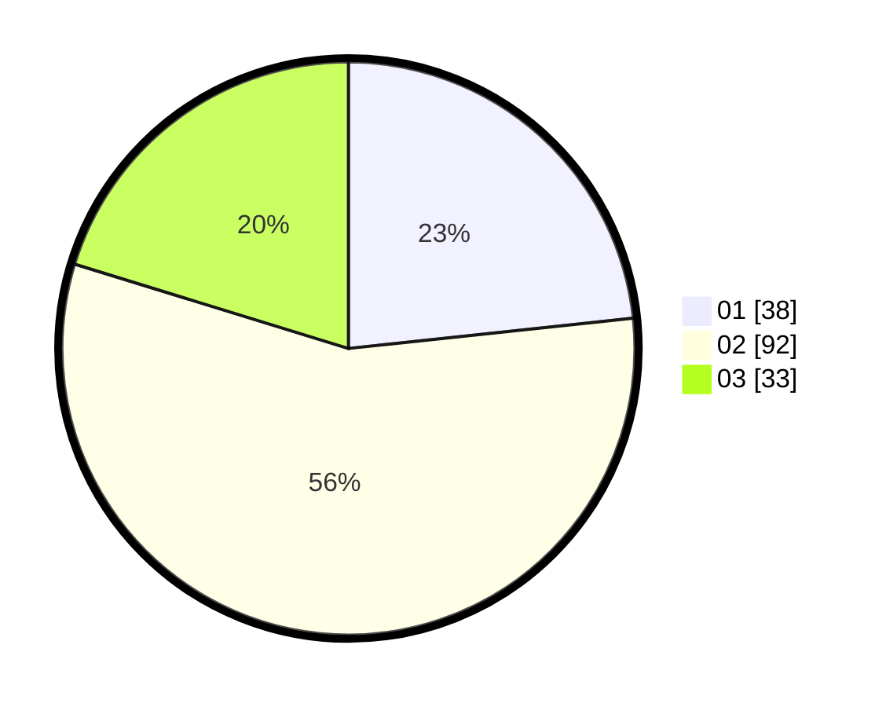

# Hasil

Hasil perolehan suara paslon dapat dilihat pada file paslon-01.txt, paslon-02.txt, dan paslon-03.txt.

Jika tidak ada, artinya data tersebut belum ada pada SIREKAP.

## Perolehan Suara

 * Paslon 01: **38**.
 * Paslon 02: **92**.
 * Paslon 03: **33**.

## Foto C Plano

https://sirekap-obj-formc.kpu.go.id/4a6a/pemilu/ppwp/31/73/04/10/07/3173041007081-20240214-201928--9306af89-1a6b-4d82-8898-abde39a466bc.jpg

https://sirekap-obj-formc.kpu.go.id/4a6a/pemilu/ppwp/31/73/04/10/07/3173041007081-20240214-202123--81459f32-a052-48d9-ad4a-7828d2417c38.jpg

https://sirekap-obj-formc.kpu.go.id/4a6a/pemilu/ppwp/31/73/04/10/07/3173041007081-20240214-202353--77852902-c7ab-4d24-aef0-17c35f438015.jpg
