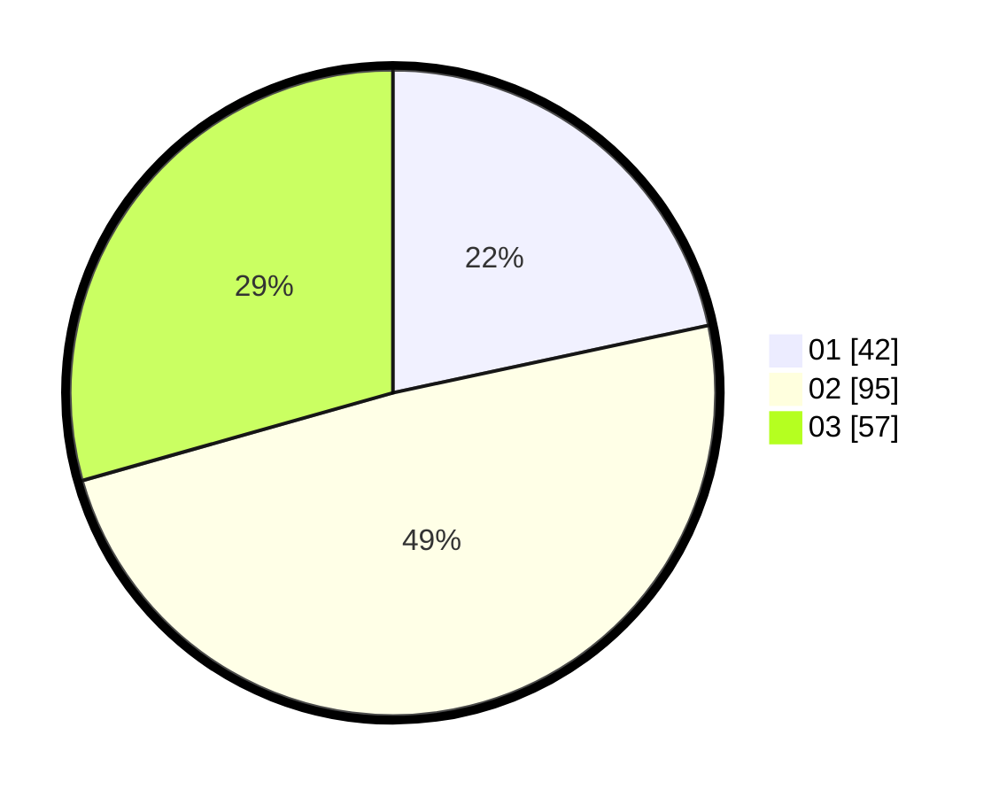

# Hasil

Hasil perolehan suara paslon dapat dilihat pada file paslon-01.txt, paslon-02.txt, dan paslon-03.txt.

Jika tidak ada, artinya data tersebut belum ada pada SIREKAP.

## Perolehan Suara

 * Paslon 01: **42**.
 * Paslon 02: **95**.
 * Paslon 03: **57**.

## Foto C Plano

https://sirekap-obj-formc.kpu.go.id/4860/pemilu/ppwp/31/73/04/10/07/3173041007083-20240214-212108--3b35e559-f34a-4c77-90d9-1f57c6addf94.jpg

https://sirekap-obj-formc.kpu.go.id/4860/pemilu/ppwp/31/73/04/10/07/3173041007083-20240214-190057--bc7169d3-c665-4ff3-a243-598083da06a7.jpg

https://sirekap-obj-formc.kpu.go.id/4860/pemilu/ppwp/31/73/04/10/07/3173041007083-20240214-184903--733e72e8-42f6-403f-b112-459d9a27fa26.jpg
