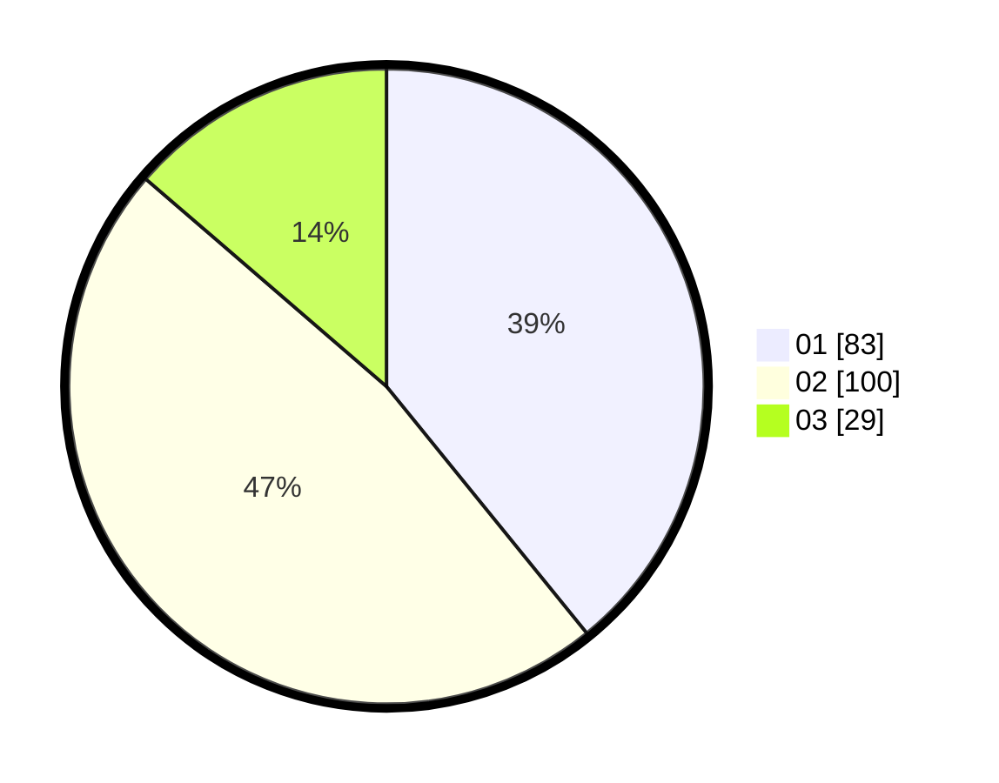

# Hasil

Hasil perolehan suara paslon dapat dilihat pada file paslon-01.txt, paslon-02.txt, dan paslon-03.txt.

Jika tidak ada, artinya data tersebut belum ada pada SIREKAP.

## Perolehan Suara

 * Paslon 01: **83**.
 * Paslon 02: **100**.
 * Paslon 03: **29**.

## Foto C Plano

https://sirekap-obj-formc.kpu.go.id/96dd/pemilu/ppwp/31/73/04/10/07/3173041007084-20240214-192928--314ad45d-fa9c-4d42-acba-7e0a208a1eab.jpg

https://sirekap-obj-formc.kpu.go.id/96dd/pemilu/ppwp/31/73/04/10/07/3173041007084-20240214-192945--aa5c5f75-a327-4500-b80a-06eea6fdd9dd.jpg

https://sirekap-obj-formc.kpu.go.id/96dd/pemilu/ppwp/31/73/04/10/07/3173041007084-20240214-192955--17e324d8-5206-427f-b42a-b77a8752f0ba.jpg

## DATA PEMILIH TETAP

Jumlah pemilih dalam DPT: **248**.
 * L: **136**.
 * P: **112**.

## DATA PENGGUNA HAK PILIH

Jumlah pengguna hak pilih dalam DPT: **208**.
 * L: **109**.
 * P: **99**.

Jumlah pengguna hak pilih dalam DPTb: **3**.
 * L: **1**.
 * P: **2**.

Jumlah pengguna hak pilih dalam DPK: **4**.
 * L: **4**.
 * P: **0**.

Jumlah pengguna hak pilih: **215**.
 * L: **114**.
 * P: **101**.

## JUMLAH SUARA SAH DAN TIDAK SAH

JUMLAH SELURUH SUARA SAH: **212**.

JUMLAH SUARA TIDAK SAH: **3**.

JUMLAH SELURUH SUARA SAH DAN SUARA TIDAK SAH: **215**.
