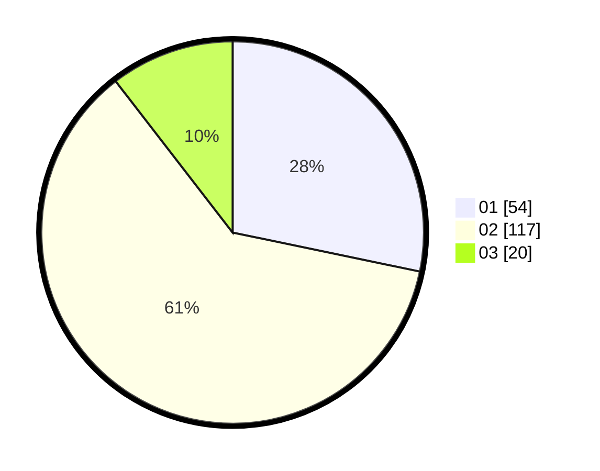

# Hasil

Hasil perolehan suara paslon dapat dilihat pada file paslon-01.txt, paslon-02.txt, dan paslon-03.txt.

Jika tidak ada, artinya data tersebut belum ada pada SIREKAP.

## Perolehan Suara

 * Paslon 01: **54**.
 * Paslon 02: **117**.
 * Paslon 03: **20**.

## Foto C Plano

https://sirekap-obj-formc.kpu.go.id/09a1/pemilu/ppwp/31/73/04/10/07/3173041007085-20240214-221341--5a806301-19ff-453c-a5ab-a7734a16efbf.jpg

https://sirekap-obj-formc.kpu.go.id/09a1/pemilu/ppwp/31/73/04/10/07/3173041007085-20240214-221424--8a8f3d75-e5c3-4298-8f4d-b8f9aded7fd2.jpg

https://sirekap-obj-formc.kpu.go.id/09a1/pemilu/ppwp/31/73/04/10/07/3173041007085-20240214-221529--2e46e7bc-9829-4871-a3bf-e95c73c0de21.jpg

## DATA PEMILIH TETAP

Jumlah pemilih dalam DPT: **253**.
 * L: **137**.
 * P: **116**.

## DATA PENGGUNA HAK PILIH

Jumlah pengguna hak pilih dalam DPT: **199**.
 * L: **105**.
 * P: **94**.

Jumlah pengguna hak pilih dalam DPTb: **0**.
 * L: **0**.
 * P: **0**.

Jumlah pengguna hak pilih dalam DPK: **1**.
 * L: **0**.
 * P: **1**.

Jumlah pengguna hak pilih: **200**.
 * L: **105**.
 * P: **95**.

## JUMLAH SUARA SAH DAN TIDAK SAH

JUMLAH SELURUH SUARA SAH: **191**.

JUMLAH SUARA TIDAK SAH: **9**.

JUMLAH SELURUH SUARA SAH DAN SUARA TIDAK SAH: **200**.
