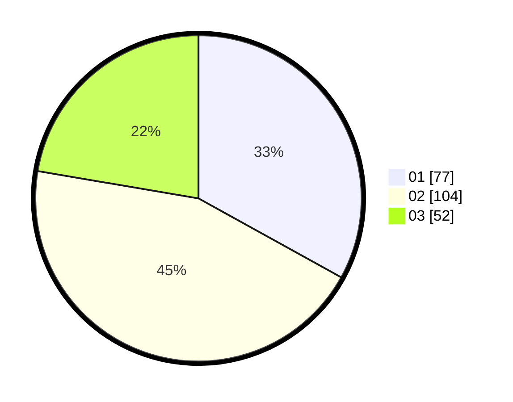

# Hasil

Hasil perolehan suara paslon dapat dilihat pada file paslon-01.txt, paslon-02.txt, dan paslon-03.txt.

Jika tidak ada, artinya data tersebut belum ada pada SIREKAP.

## Perolehan Suara

 * Paslon 01: **77**.
 * Paslon 02: **104**.
 * Paslon 03: **52**.

## Foto C Plano

https://sirekap-obj-formc.kpu.go.id/9773/pemilu/ppwp/31/73/04/10/07/3173041007092-20240215-174000--d7a84c15-0c12-4385-9508-95b0709d87ce.jpg

https://sirekap-obj-formc.kpu.go.id/9773/pemilu/ppwp/31/73/04/10/07/3173041007092-20240214-191429--113ce01f-2e10-4d7f-ade2-ed3e613ec676.jpg

https://sirekap-obj-formc.kpu.go.id/9773/pemilu/ppwp/31/73/04/10/07/3173041007092-20240214-191441--716f3171-7b4d-49cc-8eb6-e0448eddc652.jpg
