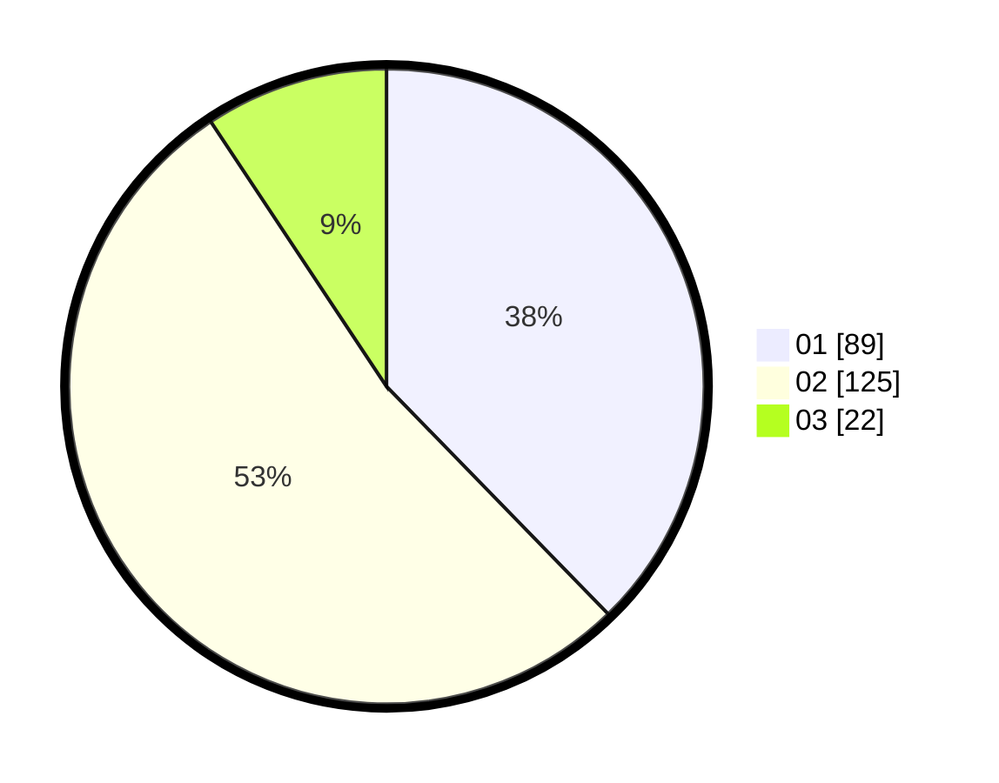

# Hasil

Hasil perolehan suara paslon dapat dilihat pada file paslon-01.txt, paslon-02.txt, dan paslon-03.txt.

Jika tidak ada, artinya data tersebut belum ada pada SIREKAP.

## Perolehan Suara

 * Paslon 01: **89**.
 * Paslon 02: **125**.
 * Paslon 03: **22**.

## Foto C Plano

https://sirekap-obj-formc.kpu.go.id/4927/pemilu/ppwp/31/73/04/10/07/3173041007096-20240214-221007--3b1750b7-e5bd-45fb-b7d4-1e8543d22517.jpg

https://sirekap-obj-formc.kpu.go.id/4927/pemilu/ppwp/31/73/04/10/07/3173041007096-20240214-221124--4b5e61f4-b61c-4bbe-a91a-0a46d15273ca.jpg

https://sirekap-obj-formc.kpu.go.id/4927/pemilu/ppwp/31/73/04/10/07/3173041007096-20240214-222540--b698e2bc-c857-496c-bf8a-bfee0bd267b0.jpg
