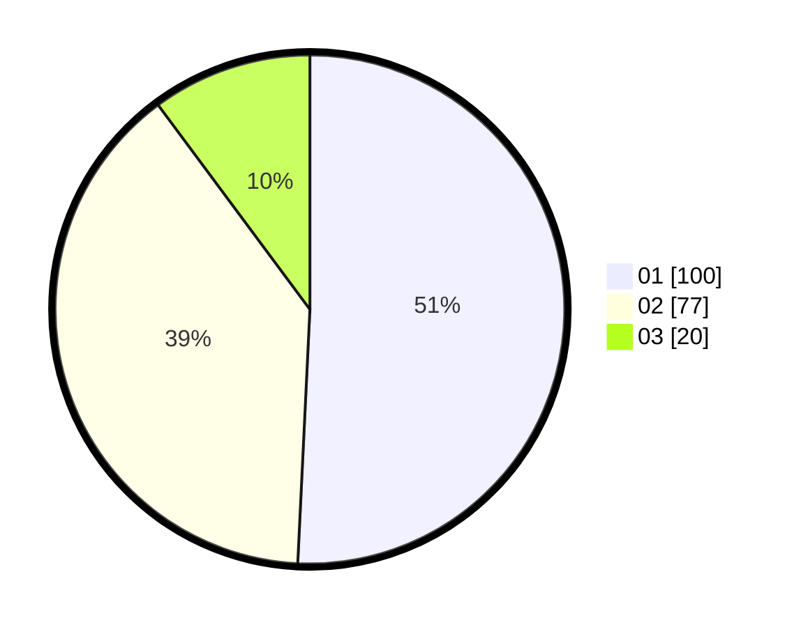

# Hasil

Hasil perolehan suara paslon dapat dilihat pada file paslon-01.txt, paslon-02.txt, dan paslon-03.txt.

Jika tidak ada, artinya data tersebut belum ada pada SIREKAP.

## Perolehan Suara

 * Paslon 01: **100**.
 * Paslon 02: **77**.
 * Paslon 03: **20**.

## Foto C Plano

https://sirekap-obj-formc.kpu.go.id/26ac/pemilu/ppwp/31/73/04/10/07/3173041007098-20240214-230150--3c56c253-61f4-45f4-b6d6-1a450bc26fbd.jpg

https://sirekap-obj-formc.kpu.go.id/26ac/pemilu/ppwp/31/73/04/10/07/3173041007098-20240214-225318--b55f0134-7d98-479b-9e60-873955e39e0d.jpg
