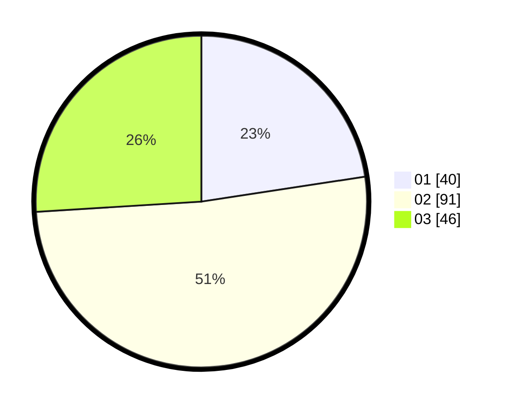

# Hasil

Hasil perolehan suara paslon dapat dilihat pada file paslon-01.txt, paslon-02.txt, dan paslon-03.txt.

Jika tidak ada, artinya data tersebut belum ada pada SIREKAP.

## Perolehan Suara

 * Paslon 01: **40**.
 * Paslon 02: **91**.
 * Paslon 03: **46**.

## Foto C Plano

https://sirekap-obj-formc.kpu.go.id/ec56/pemilu/ppwp/31/73/04/10/07/3173041007101-20240214-203004--ab2bfe23-200a-408e-a75c-5ba1641bf6b8.jpg

https://sirekap-obj-formc.kpu.go.id/ec56/pemilu/ppwp/31/73/04/10/07/3173041007101-20240214-203459--9e010fe4-d124-452a-b196-0a2632830549.jpg

https://sirekap-obj-formc.kpu.go.id/ec56/pemilu/ppwp/31/73/04/10/07/3173041007101-20240215-164952--6f74a19e-bfeb-4592-8e79-dc096ae97a76.jpg

## DATA PEMILIH TETAP

Jumlah pemilih dalam DPT: **249**.
 * L: **444**.
 * P: **435**.

## DATA PENGGUNA HAK PILIH

Jumlah pengguna hak pilih dalam DPT: **249**.
 * L: **144**.
 * P: **835**.

Jumlah pengguna hak pilih dalam DPTb: **0**.
 * L: **0**.
 * P: **0**.

Jumlah pengguna hak pilih dalam DPK: **0**.
 * L: **0**.
 * P: **88**.

Jumlah pengguna hak pilih: **249**.
 * L: **114**.
 * P: **635**.

## JUMLAH SUARA SAH DAN TIDAK SAH

JUMLAH SELURUH SUARA SAH: **177**.

JUMLAH SUARA TIDAK SAH: **6**.

JUMLAH SELURUH SUARA SAH DAN SUARA TIDAK SAH: **183**.
