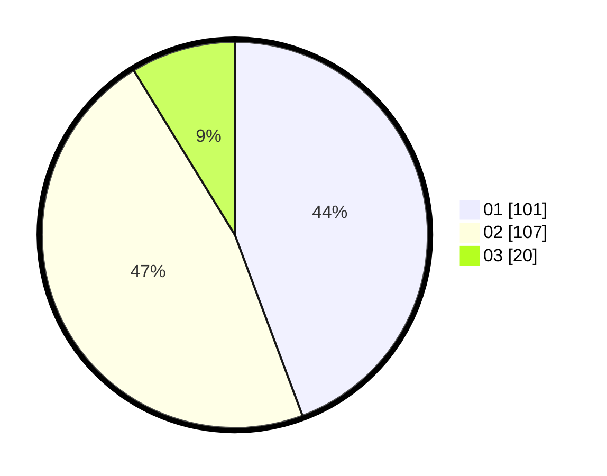

# Hasil

Hasil perolehan suara paslon dapat dilihat pada file paslon-01.txt, paslon-02.txt, dan paslon-03.txt.

Jika tidak ada, artinya data tersebut belum ada pada SIREKAP.

## Perolehan Suara

 * Paslon 01: **101**.
 * Paslon 02: **107**.
 * Paslon 03: **20**.

## Foto C Plano

https://sirekap-obj-formc.kpu.go.id/a7be/pemilu/ppwp/31/73/04/10/07/3173041007102-20240215-034839--a61c5ed9-3227-4e10-b36e-45eacf23758a.jpg

https://sirekap-obj-formc.kpu.go.id/a7be/pemilu/ppwp/31/73/04/10/07/3173041007102-20240214-212456--c045d43e-3ef9-4e22-a9a4-24ae65e91f9c.jpg

https://sirekap-obj-formc.kpu.go.id/a7be/pemilu/ppwp/31/73/04/10/07/3173041007102-20240214-213031--d2ca9362-c5c5-4fef-8dcc-ba369bb9f656.jpg
