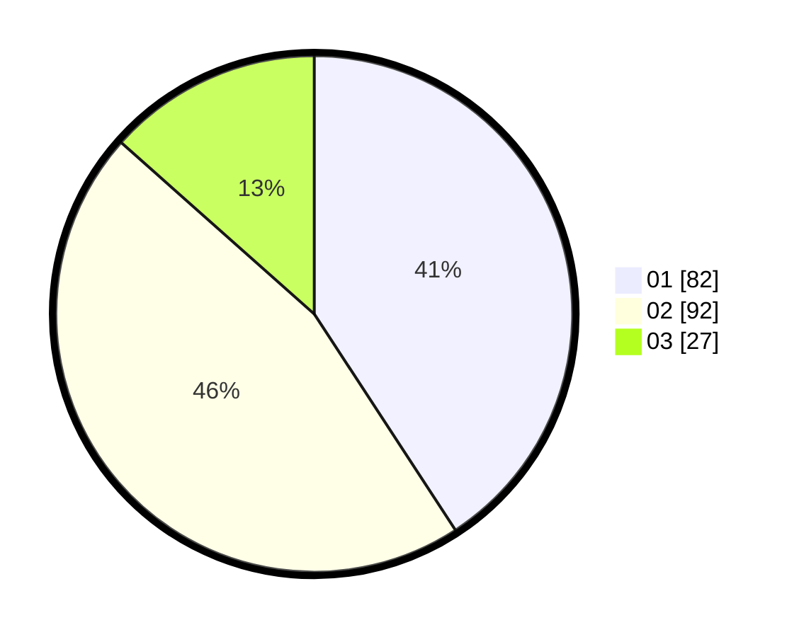

# Hasil

Hasil perolehan suara paslon dapat dilihat pada file paslon-01.txt, paslon-02.txt, dan paslon-03.txt.

Jika tidak ada, artinya data tersebut belum ada pada SIREKAP.

## Perolehan Suara

 * Paslon 01: **82**.
 * Paslon 02: **92**.
 * Paslon 03: **27**.

## Foto C Plano

https://sirekap-obj-formc.kpu.go.id/e5b9/pemilu/ppwp/31/73/04/10/08/3173041008001-20240214-204117--b8e5a54c-c662-4c65-a167-e3d8d6ce777f.jpg

https://sirekap-obj-formc.kpu.go.id/e5b9/pemilu/ppwp/31/73/04/10/08/3173041008001-20240214-201319--0f64117f-0af6-4779-8f76-2e23c3c89625.jpg

https://sirekap-obj-formc.kpu.go.id/e5b9/pemilu/ppwp/31/73/04/10/08/3173041008001-20240214-200813--0f415ccd-99ac-4ee4-94dc-615be544184d.jpg
