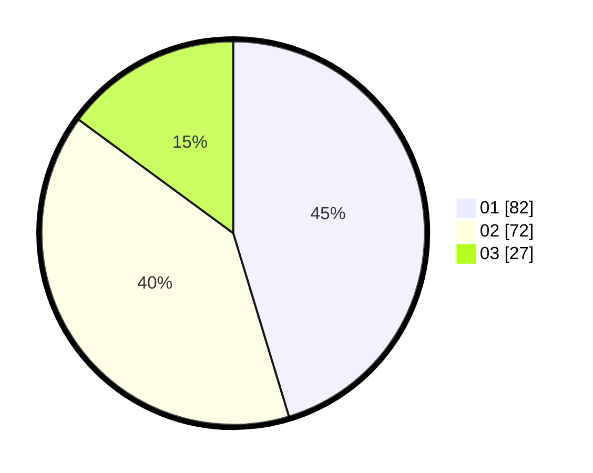

# Hasil

Hasil perolehan suara paslon dapat dilihat pada file paslon-01.txt, paslon-02.txt, dan paslon-03.txt.

Jika tidak ada, artinya data tersebut belum ada pada SIREKAP.

## Perolehan Suara

 * Paslon 01: **82**.
 * Paslon 02: **72**.
 * Paslon 03: **27**.

## Foto C Plano

https://sirekap-obj-formc.kpu.go.id/5cb6/pemilu/ppwp/31/73/04/10/08/3173041008005-20240214-185014--ed145851-0e31-4553-9bf3-eb55278b8d52.jpg

https://sirekap-obj-formc.kpu.go.id/5cb6/pemilu/ppwp/31/73/04/10/08/3173041008005-20240215-134405--c90432f3-3017-4353-b3dc-039e875104c2.jpg

https://sirekap-obj-formc.kpu.go.id/5cb6/pemilu/ppwp/31/73/04/10/08/3173041008005-20240215-092012--7a39e9b1-b61b-429b-9ecc-a22bd5315c56.jpg

## DATA PEMILIH TETAP

Jumlah pemilih dalam DPT: **224**.
 * L: **106**.
 * P: **118**.

## DATA PENGGUNA HAK PILIH

Jumlah pengguna hak pilih dalam DPT: **183**.
 * L: **88**.
 * P: **95**.

Jumlah pengguna hak pilih dalam DPTb: **0**.
 * L: **0**.
 * P: **0**.

Jumlah pengguna hak pilih dalam DPK: **0**.
 * L: **0**.
 * P: **0**.

Jumlah pengguna hak pilih: **183**.
 * L: **88**.
 * P: **95**.

## JUMLAH SUARA SAH DAN TIDAK SAH

JUMLAH SELURUH SUARA SAH: **181**.

JUMLAH SUARA TIDAK SAH: **2**.

JUMLAH SELURUH SUARA SAH DAN SUARA TIDAK SAH: **183**.
