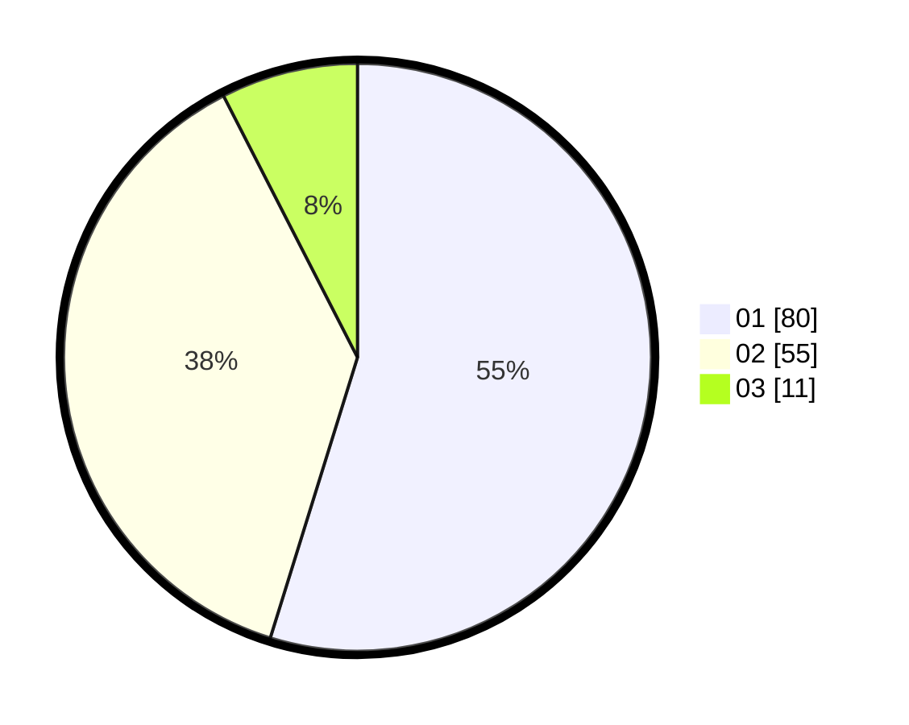

# Hasil

Hasil perolehan suara paslon dapat dilihat pada file paslon-01.txt, paslon-02.txt, dan paslon-03.txt.

Jika tidak ada, artinya data tersebut belum ada pada SIREKAP.

## Perolehan Suara

 * Paslon 01: **80**.
 * Paslon 02: **55**.
 * Paslon 03: **11**.

## Foto C Plano

https://sirekap-obj-formc.kpu.go.id/0aa5/pemilu/ppwp/31/73/04/10/08/3173041008006-20240214-222837--7fc6d89a-5512-49cd-adbe-bb7d5415bb1c.jpg

https://sirekap-obj-formc.kpu.go.id/0aa5/pemilu/ppwp/31/73/04/10/08/3173041008006-20240214-223000--ad281445-9954-4d74-9f56-098bbb610e00.jpg

https://sirekap-obj-formc.kpu.go.id/0aa5/pemilu/ppwp/31/73/04/10/08/3173041008006-20240215-152418--69932c9d-2020-43bf-a74e-090078e94eb0.jpg
