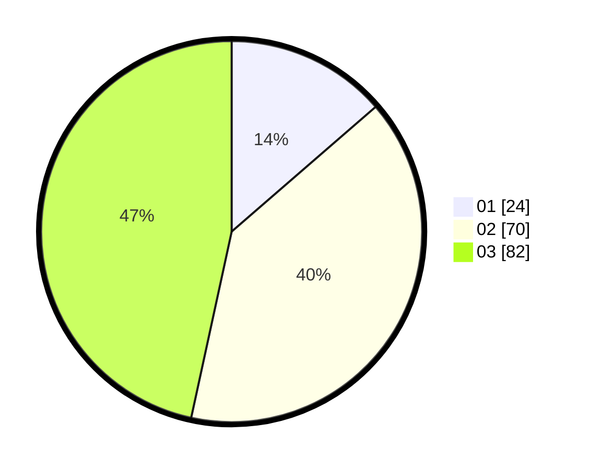

# Hasil

Hasil perolehan suara paslon dapat dilihat pada file paslon-01.txt, paslon-02.txt, dan paslon-03.txt.

Jika tidak ada, artinya data tersebut belum ada pada SIREKAP.

## Perolehan Suara

 * Paslon 01: **24**.
 * Paslon 02: **70**.
 * Paslon 03: **82**.

## Foto C Plano

https://sirekap-obj-formc.kpu.go.id/2ea9/pemilu/ppwp/31/73/04/10/08/3173041008014-20240214-214224--61dd789e-a052-493c-b514-601d0d0e28c9.jpg

https://sirekap-obj-formc.kpu.go.id/2ea9/pemilu/ppwp/31/73/04/10/08/3173041008014-20240214-214444--49fcd4bb-6eac-41c1-ba30-30ebc5700293.jpg

https://sirekap-obj-formc.kpu.go.id/2ea9/pemilu/ppwp/31/73/04/10/08/3173041008014-20240214-214639--4ff772ba-5348-4460-bc5f-ce8266cc8f59.jpg
