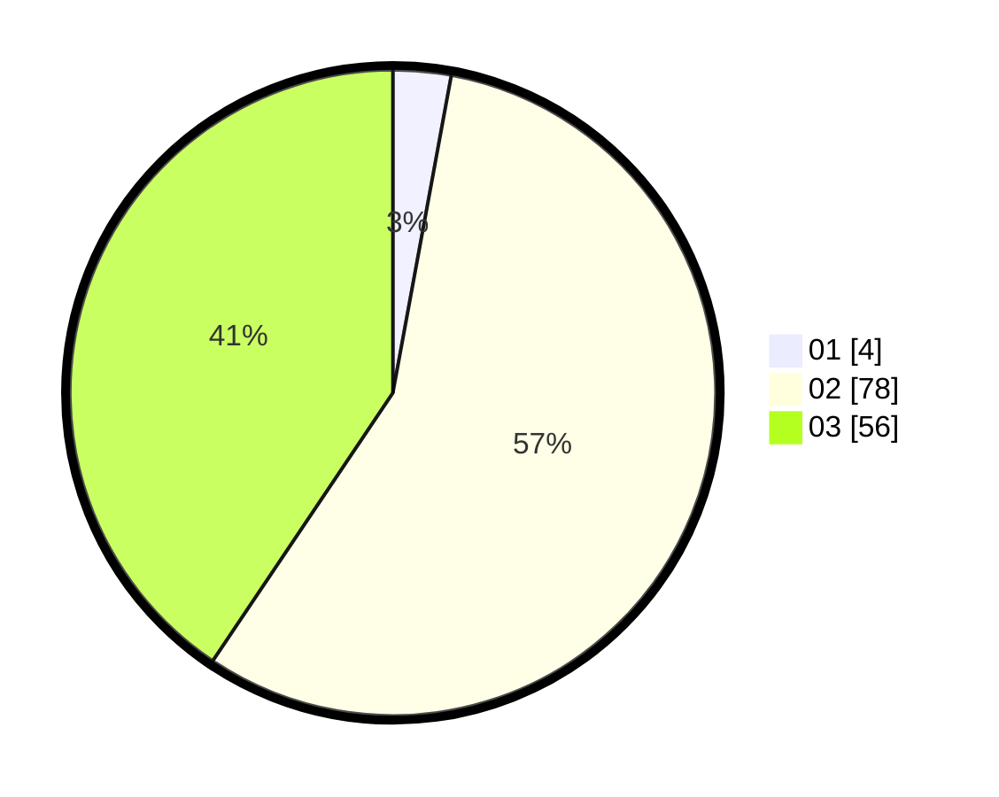

# Hasil

Hasil perolehan suara paslon dapat dilihat pada file paslon-01.txt, paslon-02.txt, dan paslon-03.txt.

Jika tidak ada, artinya data tersebut belum ada pada SIREKAP.

## Perolehan Suara

 * Paslon 01: **4**.
 * Paslon 02: **78**.
 * Paslon 03: **56**.

## Foto C Plano

https://sirekap-obj-formc.kpu.go.id/4193/pemilu/ppwp/31/73/04/10/08/3173041008015-20240214-192127--e42928a9-7e1f-4fe6-a2f1-2b80c53822f6.jpg

https://sirekap-obj-formc.kpu.go.id/4193/pemilu/ppwp/31/73/04/10/08/3173041008015-20240214-160128--7a3f0960-2328-40c1-a308-faa8a8e4d472.jpg

https://sirekap-obj-formc.kpu.go.id/4193/pemilu/ppwp/31/73/04/10/08/3173041008015-20240214-194734--c1cea4c9-ca36-4440-8c0b-d92a46e954b7.jpg

## DATA PEMILIH TETAP

Jumlah pemilih dalam DPT: **218**.
 * L: **110**.
 * P: **108**.

## DATA PENGGUNA HAK PILIH

Jumlah pengguna hak pilih dalam DPT: **142**.
 * L: **71**.
 * P: **71**.

Jumlah pengguna hak pilih dalam DPTb: **1**.
 * L: **0**.
 * P: **1**.

Jumlah pengguna hak pilih dalam DPK: **0**.
 * L: **0**.
 * P: **0**.

Jumlah pengguna hak pilih: **143**.
 * L: **71**.
 * P: **72**.

## JUMLAH SUARA SAH DAN TIDAK SAH

JUMLAH SELURUH SUARA SAH: **138**.

JUMLAH SUARA TIDAK SAH: **5**.

JUMLAH SELURUH SUARA SAH DAN SUARA TIDAK SAH: **143**.
