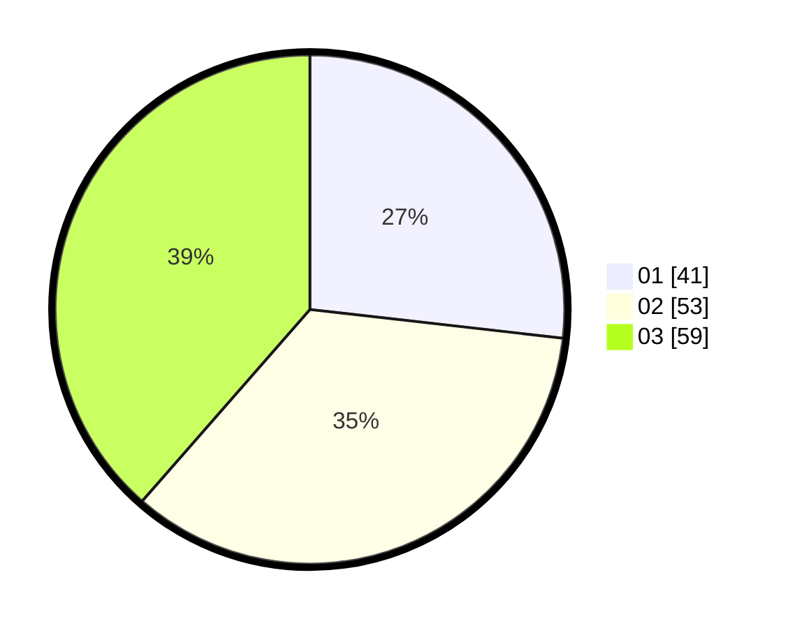

# Hasil

Hasil perolehan suara paslon dapat dilihat pada file paslon-01.txt, paslon-02.txt, dan paslon-03.txt.

Jika tidak ada, artinya data tersebut belum ada pada SIREKAP.

## Perolehan Suara

 * Paslon 01: **41**.
 * Paslon 02: **53**.
 * Paslon 03: **59**.

## Foto C Plano

https://sirekap-obj-formc.kpu.go.id/a825/pemilu/ppwp/31/73/04/10/08/3173041008016-20240214-212412--fa5e4422-1021-4914-b968-2dea3bb4393c.jpg

https://sirekap-obj-formc.kpu.go.id/a825/pemilu/ppwp/31/73/04/10/08/3173041008016-20240214-212635--10009f70-4a34-4541-bc67-8f6cb1c9dbbb.jpg

https://sirekap-obj-formc.kpu.go.id/a825/pemilu/ppwp/31/73/04/10/08/3173041008016-20240214-212838--c87307bb-0d6b-4419-8761-5bf43aaad3f3.jpg
