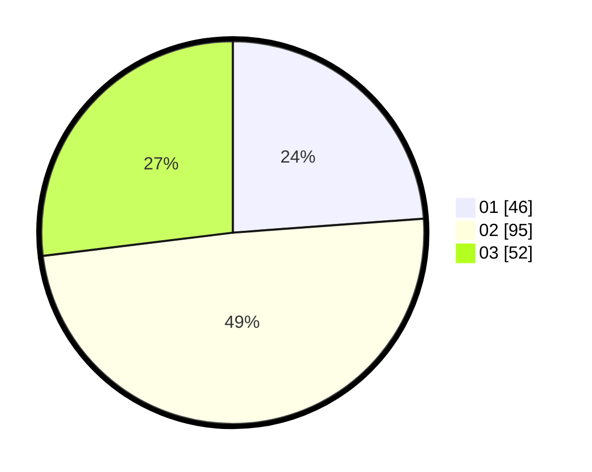

# Hasil

Hasil perolehan suara paslon dapat dilihat pada file paslon-01.txt, paslon-02.txt, dan paslon-03.txt.

Jika tidak ada, artinya data tersebut belum ada pada SIREKAP.

## Perolehan Suara

 * Paslon 01: **46**.
 * Paslon 02: **95**.
 * Paslon 03: **52**.

## Foto C Plano

https://sirekap-obj-formc.kpu.go.id/0677/pemilu/ppwp/31/73/04/10/08/3173041008019-20240214-190739--508b43f1-ea23-47ad-83e1-edbfbcd772f4.jpg

https://sirekap-obj-formc.kpu.go.id/0677/pemilu/ppwp/31/73/04/10/08/3173041008019-20240214-192946--c7694367-741c-4abe-b931-24dee7585cfa.jpg

https://sirekap-obj-formc.kpu.go.id/0677/pemilu/ppwp/31/73/04/10/08/3173041008019-20240215-225112--362e7bbc-db0a-46b0-875a-0ba05096b7b3.jpg

## DATA PEMILIH TETAP

Jumlah pemilih dalam DPT: **272**.
 * L: **140**.
 * P: **132**.

## DATA PENGGUNA HAK PILIH

Jumlah pengguna hak pilih dalam DPT: **196**.
 * L: **101**.
 * P: **95**.

Jumlah pengguna hak pilih dalam DPTb: **1**.
 * L: **0**.
 * P: **1**.

Jumlah pengguna hak pilih dalam DPK: **0**.
 * L: **0**.
 * P: **0**.

Jumlah pengguna hak pilih: **197**.
 * L: **101**.
 * P: **96**.

## JUMLAH SUARA SAH DAN TIDAK SAH

JUMLAH SELURUH SUARA SAH: **193**.

JUMLAH SUARA TIDAK SAH: **4**.

JUMLAH SELURUH SUARA SAH DAN SUARA TIDAK SAH: **197**.
