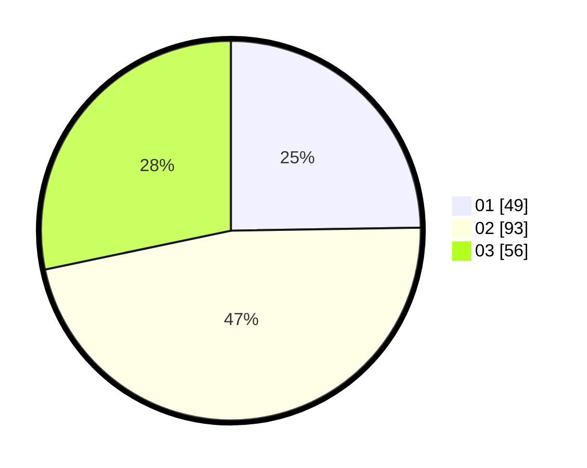

# Hasil

Hasil perolehan suara paslon dapat dilihat pada file paslon-01.txt, paslon-02.txt, dan paslon-03.txt.

Jika tidak ada, artinya data tersebut belum ada pada SIREKAP.

## Perolehan Suara

 * Paslon 01: **49**.
 * Paslon 02: **93**.
 * Paslon 03: **56**.

## Foto C Plano

https://sirekap-obj-formc.kpu.go.id/1b74/pemilu/ppwp/31/73/04/10/08/3173041008020-20240214-155244--0cab65fd-1111-4324-8917-66213df96aa9.jpg

https://sirekap-obj-formc.kpu.go.id/1b74/pemilu/ppwp/31/73/04/10/08/3173041008020-20240214-155351--7989fbd6-a08c-4fd3-87b4-2073f671a97c.jpg

https://sirekap-obj-formc.kpu.go.id/1b74/pemilu/ppwp/31/73/04/10/08/3173041008020-20240214-201309--c455aca1-7c83-4184-a549-f179f8af8aa1.jpg

## DATA PEMILIH TETAP

Jumlah pemilih dalam DPT: **201**.
 * L: **96**.
 * P: **105**.

## DATA PENGGUNA HAK PILIH

Jumlah pengguna hak pilih dalam DPT: **201**.
 * L: **96**.
 * P: **105**.

Jumlah pengguna hak pilih dalam DPTb: **0**.
 * L: **0**.
 * P: **0**.

Jumlah pengguna hak pilih dalam DPK: **0**.
 * L: **0**.
 * P: **0**.

Jumlah pengguna hak pilih: **0**.
 * L: **0**.
 * P: **0**.

## JUMLAH SUARA SAH DAN TIDAK SAH

JUMLAH SELURUH SUARA SAH: **198**.

JUMLAH SUARA TIDAK SAH: **3**.

JUMLAH SELURUH SUARA SAH DAN SUARA TIDAK SAH: **201**.
