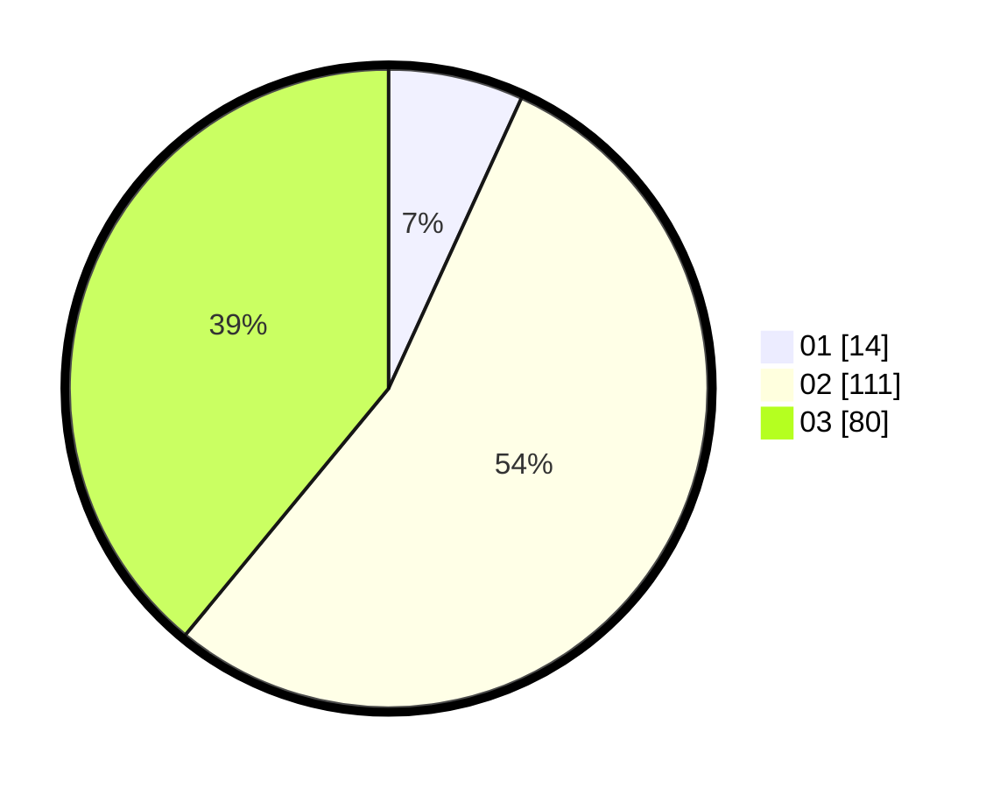

# Hasil

Hasil perolehan suara paslon dapat dilihat pada file paslon-01.txt, paslon-02.txt, dan paslon-03.txt.

Jika tidak ada, artinya data tersebut belum ada pada SIREKAP.

## Perolehan Suara

 * Paslon 01: **14**.
 * Paslon 02: **111**.
 * Paslon 03: **80**.

## Foto C Plano

https://sirekap-obj-formc.kpu.go.id/0950/pemilu/ppwp/31/73/04/10/08/3173041008021-20240214-193203--9f0d9796-10ab-4fe1-bd53-c7ca885a1991.jpg

https://sirekap-obj-formc.kpu.go.id/0950/pemilu/ppwp/31/73/04/10/08/3173041008021-20240214-162234--7716dc75-1357-47a5-9082-52e03313bf71.jpg

https://sirekap-obj-formc.kpu.go.id/0950/pemilu/ppwp/31/73/04/10/08/3173041008021-20240214-195821--435d7d65-6ecd-4214-b7f9-cab37bca303d.jpg

## DATA PEMILIH TETAP

Jumlah pemilih dalam DPT: **284**.
 * L: **135**.
 * P: **149**.

## DATA PENGGUNA HAK PILIH

Jumlah pengguna hak pilih dalam DPT: **205**.
 * L: **92**.
 * P: **113**.

Jumlah pengguna hak pilih dalam DPTb: **1**.
 * L: **0**.
 * P: **1**.

Jumlah pengguna hak pilih dalam DPK: **1**.
 * L: **1**.
 * P: **0**.

Jumlah pengguna hak pilih: **207**.
 * L: **93**.
 * P: **114**.

## JUMLAH SUARA SAH DAN TIDAK SAH

JUMLAH SELURUH SUARA SAH: **205**.

JUMLAH SUARA TIDAK SAH: **2**.

JUMLAH SELURUH SUARA SAH DAN SUARA TIDAK SAH: **207**.
