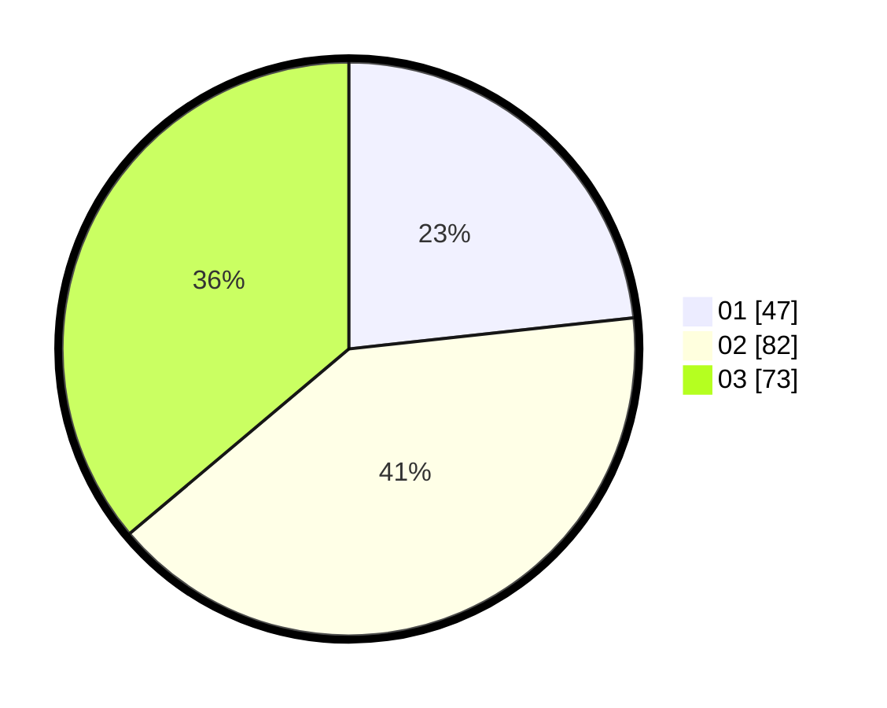

# Hasil

Hasil perolehan suara paslon dapat dilihat pada file paslon-01.txt, paslon-02.txt, dan paslon-03.txt.

Jika tidak ada, artinya data tersebut belum ada pada SIREKAP.

## Perolehan Suara

 * Paslon 01: **47**.
 * Paslon 02: **82**.
 * Paslon 03: **73**.

## Foto C Plano

https://sirekap-obj-formc.kpu.go.id/4234/pemilu/ppwp/31/73/04/10/08/3173041008024-20240214-221119--6c604ddf-350b-4aa7-b373-e9b82fd11b6c.jpg

https://sirekap-obj-formc.kpu.go.id/4234/pemilu/ppwp/31/73/04/10/08/3173041008024-20240214-212602--69760adf-cd1c-4d5f-bde5-65e5047f9405.jpg

https://sirekap-obj-formc.kpu.go.id/4234/pemilu/ppwp/31/73/04/10/08/3173041008024-20240214-212741--da12dd0c-8ae1-4ee6-ac18-740e90469ed1.jpg
