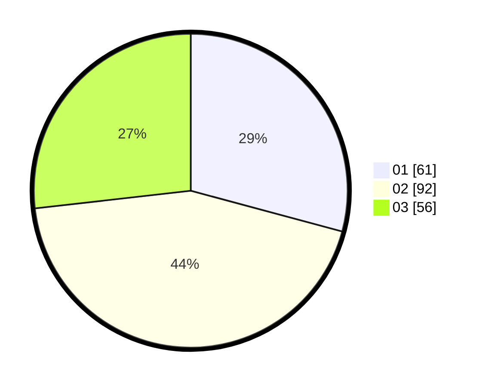

# Hasil

Hasil perolehan suara paslon dapat dilihat pada file paslon-01.txt, paslon-02.txt, dan paslon-03.txt.

Jika tidak ada, artinya data tersebut belum ada pada SIREKAP.

## Perolehan Suara

 * Paslon 01: **61**.
 * Paslon 02: **92**.
 * Paslon 03: **56**.

## Foto C Plano

https://sirekap-obj-formc.kpu.go.id/818e/pemilu/ppwp/31/73/04/10/08/3173041008028-20240214-191604--d2d916ce-a12b-42ae-9ef1-2a684c0180ec.jpg

https://sirekap-obj-formc.kpu.go.id/818e/pemilu/ppwp/31/73/04/10/08/3173041008028-20240214-192425--23da81d6-1c94-4f44-affe-ad07545f42ea.jpg

https://sirekap-obj-formc.kpu.go.id/818e/pemilu/ppwp/31/73/04/10/08/3173041008028-20240214-193223--92598b48-a618-44c4-9980-69cc04ab0283.jpg

## DATA PEMILIH TETAP

Jumlah pemilih dalam DPT: **278**.
 * L: **139**.
 * P: **139**.

## DATA PENGGUNA HAK PILIH

Jumlah pengguna hak pilih dalam DPT: **215**.
 * L: **105**.
 * P: **110**.

Jumlah pengguna hak pilih dalam DPTb: **0**.
 * L: **0**.
 * P: **0**.

Jumlah pengguna hak pilih dalam DPK: **0**.
 * L: **0**.
 * P: **0**.

Jumlah pengguna hak pilih: **215**.
 * L: **105**.
 * P: **110**.

## JUMLAH SUARA SAH DAN TIDAK SAH

JUMLAH SELURUH SUARA SAH: **209**.

JUMLAH SUARA TIDAK SAH: **6**.

JUMLAH SELURUH SUARA SAH DAN SUARA TIDAK SAH: **215**.
