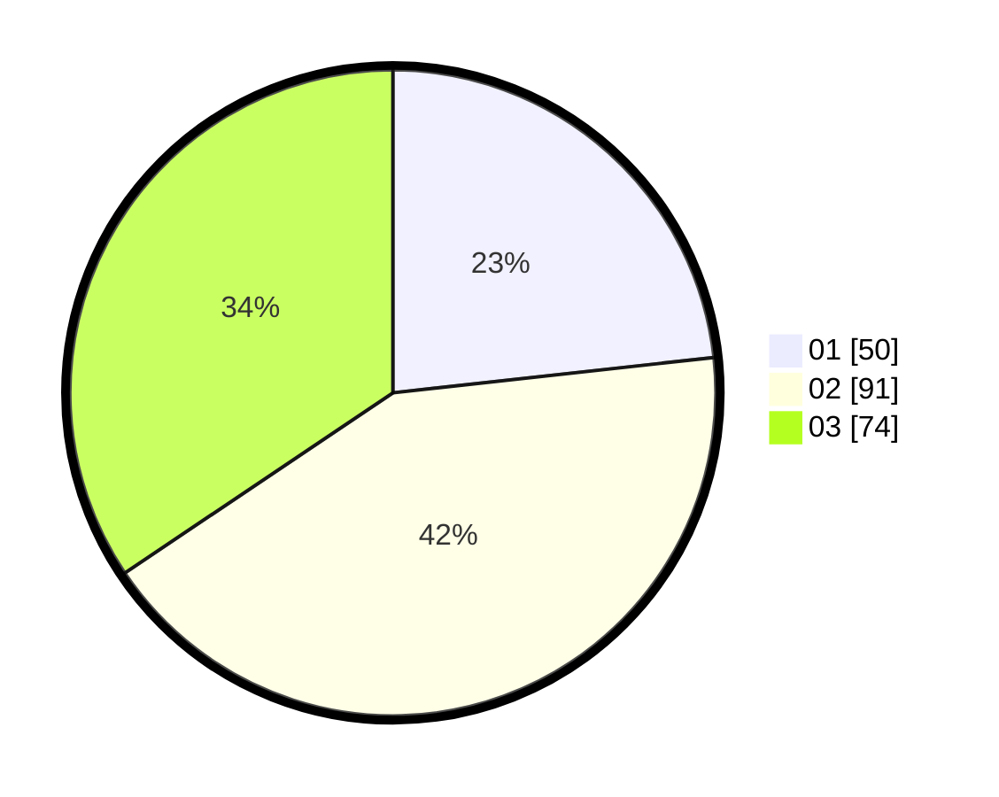

# Hasil

Hasil perolehan suara paslon dapat dilihat pada file paslon-01.txt, paslon-02.txt, dan paslon-03.txt.

Jika tidak ada, artinya data tersebut belum ada pada SIREKAP.

## Perolehan Suara

 * Paslon 01: **50**.
 * Paslon 02: **91**.
 * Paslon 03: **74**.

## Foto C Plano

https://sirekap-obj-formc.kpu.go.id/cb59/pemilu/ppwp/31/73/04/10/08/3173041008029-20240214-155321--383c5b07-70aa-447a-b63f-220d54331a2f.jpg

https://sirekap-obj-formc.kpu.go.id/cb59/pemilu/ppwp/31/73/04/10/08/3173041008029-20240214-155432--03822b89-53f8-4652-a59f-936ffe74dd16.jpg

https://sirekap-obj-formc.kpu.go.id/cb59/pemilu/ppwp/31/73/04/10/08/3173041008029-20240214-155624--17c564a2-aaeb-4a32-ba36-5d2e7e8e7bd7.jpg

## DATA PEMILIH TETAP

Jumlah pemilih dalam DPT: **280**.
 * L: **131**.
 * P: **149**.

## DATA PENGGUNA HAK PILIH

Jumlah pengguna hak pilih dalam DPT: **218**.
 * L: **96**.
 * P: **122**.

Jumlah pengguna hak pilih dalam DPTb: **0**.
 * L: **0**.
 * P: **0**.

Jumlah pengguna hak pilih dalam DPK: **1**.
 * L: **0**.
 * P: **1**.

Jumlah pengguna hak pilih: **219**.
 * L: **96**.
 * P: **123**.

## JUMLAH SUARA SAH DAN TIDAK SAH

JUMLAH SELURUH SUARA SAH: **215**.

JUMLAH SUARA TIDAK SAH: **4**.

JUMLAH SELURUH SUARA SAH DAN SUARA TIDAK SAH: **219**.
