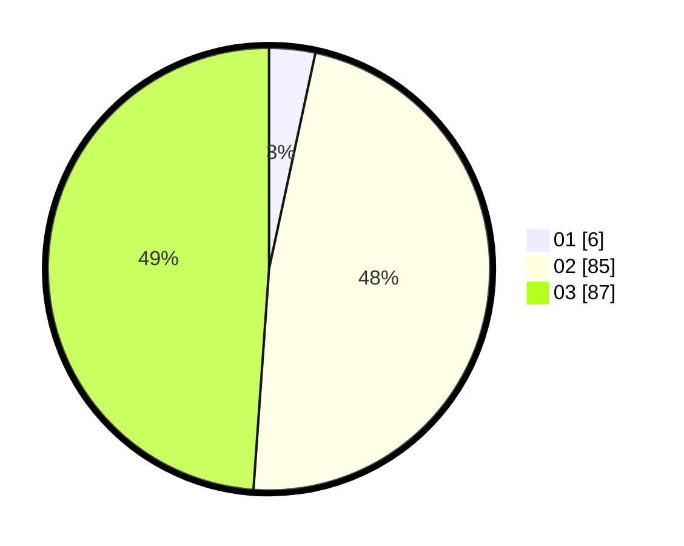

# Hasil

Hasil perolehan suara paslon dapat dilihat pada file paslon-01.txt, paslon-02.txt, dan paslon-03.txt.

Jika tidak ada, artinya data tersebut belum ada pada SIREKAP.

## Perolehan Suara

 * Paslon 01: **6**.
 * Paslon 02: **85**.
 * Paslon 03: **87**.

## Foto C Plano

https://sirekap-obj-formc.kpu.go.id/562e/pemilu/ppwp/31/73/04/10/08/3173041008030-20240214-201141--714871c0-3bb1-4515-ae4b-d43919419144.jpg

https://sirekap-obj-formc.kpu.go.id/562e/pemilu/ppwp/31/73/04/10/08/3173041008030-20240214-201231--6a75b25a-2843-4395-9fe3-65a83f18497b.jpg

https://sirekap-obj-formc.kpu.go.id/562e/pemilu/ppwp/31/73/04/10/08/3173041008030-20240214-155314--efb0906d-7345-4efa-9465-f1140871ee91.jpg

## DATA PEMILIH TETAP

Jumlah pemilih dalam DPT: **249**.
 * L: **119**.
 * P: **130**.

## DATA PENGGUNA HAK PILIH

Jumlah pengguna hak pilih dalam DPT: **178**.
 * L: **84**.
 * P: **94**.

Jumlah pengguna hak pilih dalam DPTb: **0**.
 * L: **0**.
 * P: **0**.

Jumlah pengguna hak pilih dalam DPK: **1**.
 * L: **0**.
 * P: **1**.

Jumlah pengguna hak pilih: **179**.
 * L: **84**.
 * P: **95**.

## JUMLAH SUARA SAH DAN TIDAK SAH

JUMLAH SELURUH SUARA SAH: **178**.

JUMLAH SUARA TIDAK SAH: **1**.

JUMLAH SELURUH SUARA SAH DAN SUARA TIDAK SAH: **179**.
