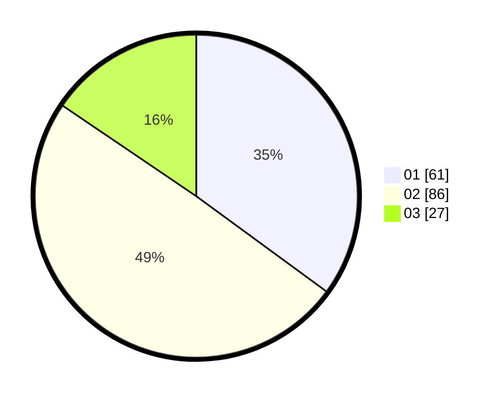

# Hasil

Hasil perolehan suara paslon dapat dilihat pada file paslon-01.txt, paslon-02.txt, dan paslon-03.txt.

Jika tidak ada, artinya data tersebut belum ada pada SIREKAP.

## Perolehan Suara

 * Paslon 01: **61**.
 * Paslon 02: **86**.
 * Paslon 03: **27**.

## Foto C Plano

https://sirekap-obj-formc.kpu.go.id/5604/pemilu/ppwp/31/73/04/10/08/3173041008033-20240214-223734--7ff38852-1aa6-461f-88f4-11042ebea4f6.jpg

https://sirekap-obj-formc.kpu.go.id/5604/pemilu/ppwp/31/73/04/10/08/3173041008033-20240214-223941--adcaf985-a17e-4edf-9197-a801009e4228.jpg

https://sirekap-obj-formc.kpu.go.id/5604/pemilu/ppwp/31/73/04/10/08/3173041008033-20240214-224046--7e0130ec-4e97-4f9e-a910-5e7c461ecac7.jpg

## DATA PEMILIH TETAP

Jumlah pemilih dalam DPT: **192**.
 * L: **97**.
 * P: **95**.

## DATA PENGGUNA HAK PILIH

Jumlah pengguna hak pilih dalam DPT: **191**.
 * L: **96**.
 * P: **95**.

Jumlah pengguna hak pilih dalam DPTb: **1**.
 * L: **1**.
 * P: **0**.

Jumlah pengguna hak pilih dalam DPK: **0**.
 * L: **0**.
 * P: **0**.

Jumlah pengguna hak pilih: **192**.
 * L: **97**.
 * P: **95**.

## JUMLAH SUARA SAH DAN TIDAK SAH

JUMLAH SELURUH SUARA SAH: **174**.

JUMLAH SUARA TIDAK SAH: **18**.

JUMLAH SELURUH SUARA SAH DAN SUARA TIDAK SAH: **192**.
