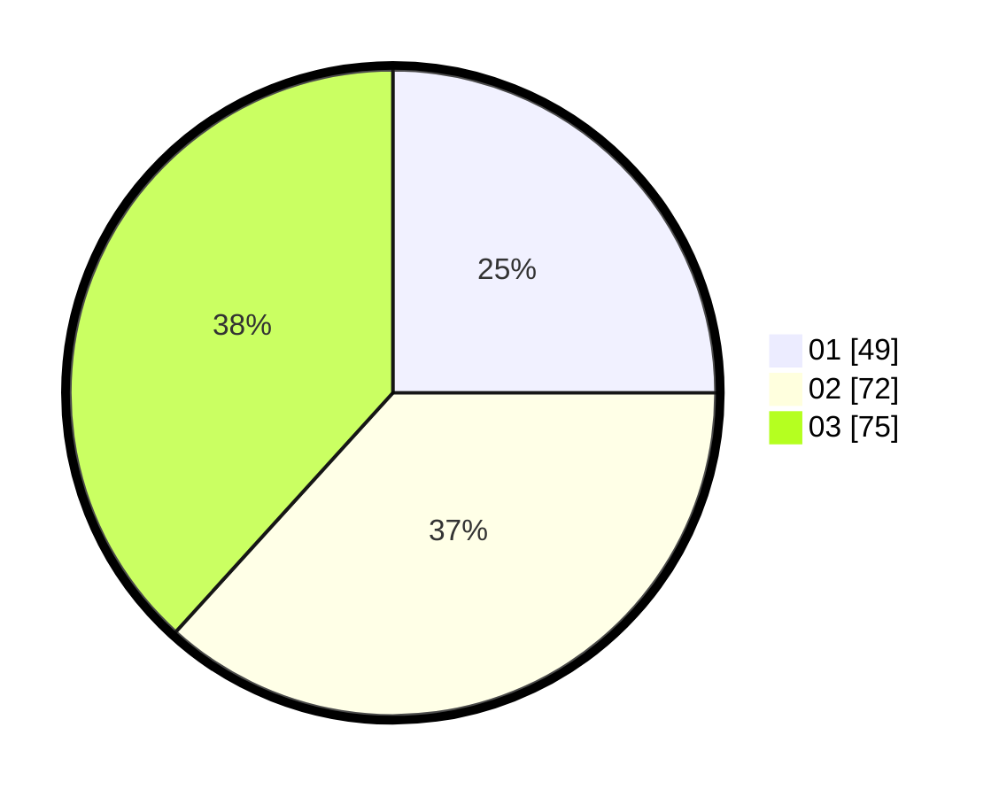

# Hasil

Hasil perolehan suara paslon dapat dilihat pada file paslon-01.txt, paslon-02.txt, dan paslon-03.txt.

Jika tidak ada, artinya data tersebut belum ada pada SIREKAP.

## Perolehan Suara

 * Paslon 01: **49**.
 * Paslon 02: **72**.
 * Paslon 03: **75**.

## Foto C Plano

https://sirekap-obj-formc.kpu.go.id/684f/pemilu/ppwp/31/73/04/10/08/3173041008036-20240214-204521--af3c8a8e-535f-4459-8f42-59b7cc55cb44.jpg

https://sirekap-obj-formc.kpu.go.id/684f/pemilu/ppwp/31/73/04/10/08/3173041008036-20240214-204639--439c1b87-ff02-4b90-b5d8-50d8f736f977.jpg

https://sirekap-obj-formc.kpu.go.id/684f/pemilu/ppwp/31/73/04/10/08/3173041008036-20240214-204733--f32ab3e3-02ee-438c-a16d-bfdc9ca1ae75.jpg
