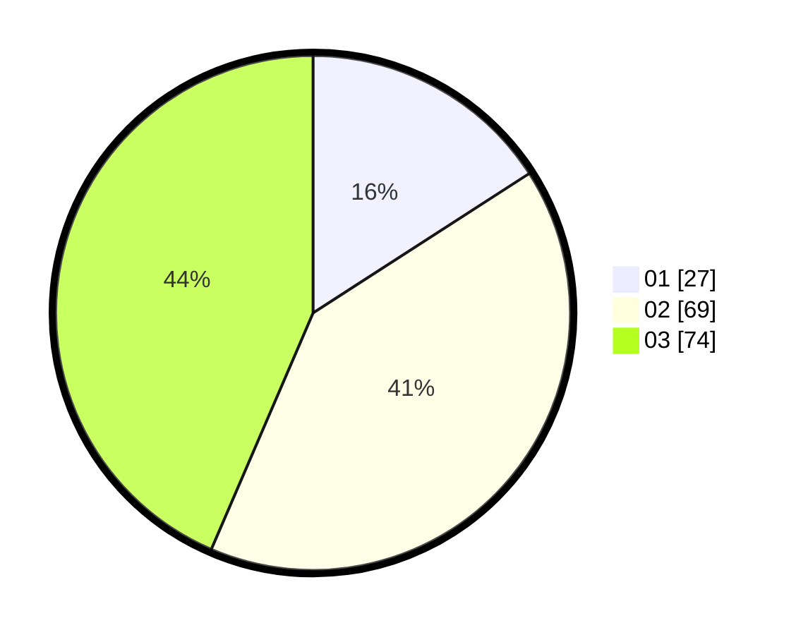

# Hasil

Hasil perolehan suara paslon dapat dilihat pada file paslon-01.txt, paslon-02.txt, dan paslon-03.txt.

Jika tidak ada, artinya data tersebut belum ada pada SIREKAP.

## Perolehan Suara

 * Paslon 01: **27**.
 * Paslon 02: **69**.
 * Paslon 03: **74**.

## Foto C Plano

https://sirekap-obj-formc.kpu.go.id/a668/pemilu/ppwp/31/73/04/10/08/3173041008038-20240214-215008--1644f9fe-9dd4-431e-b7c8-da986f7608a1.jpg

https://sirekap-obj-formc.kpu.go.id/a668/pemilu/ppwp/31/73/04/10/08/3173041008038-20240214-203407--9010c7d7-cd56-43c7-86db-8a184b47a06d.jpg

https://sirekap-obj-formc.kpu.go.id/a668/pemilu/ppwp/31/73/04/10/08/3173041008038-20240214-215456--141e199a-23cf-421d-805d-7e5f94c6f2db.jpg
